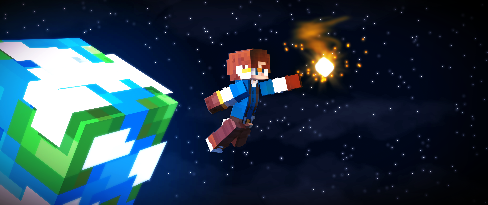
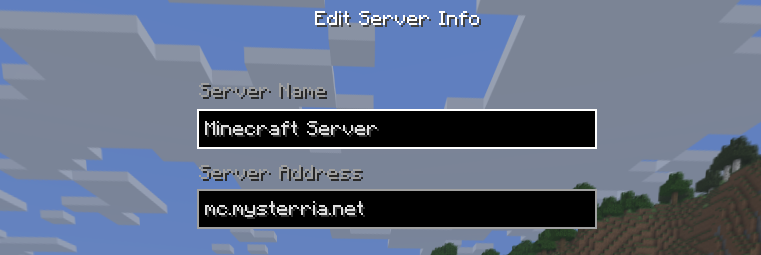
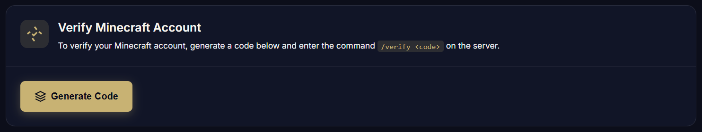
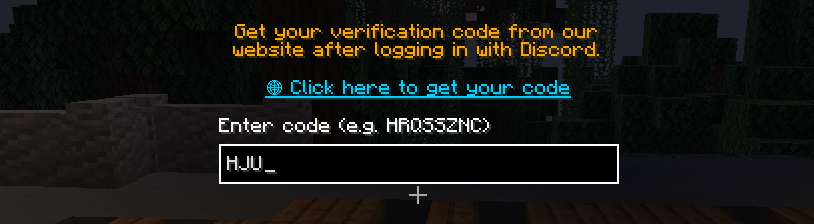
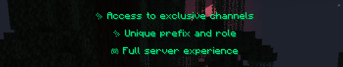
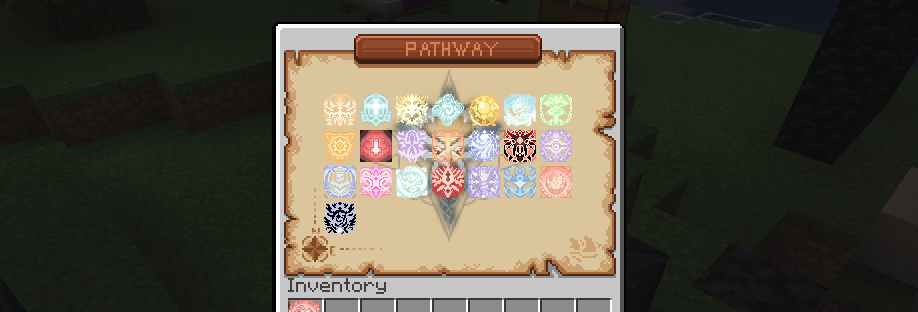

## Erste Schritte:

### 1. Mit dem Server verbinden
- **Server-IP**: `mc.mysterria.net`
- **Minecraft-Version**: 1.21 - 26.1.2
- **Server-Typ**: Vanilla mit Plugins - keine Mods erforderlich

:::caution[Akzeptiere das Ressourcenpaket!]
Wenn du beitrittst, **akzeptiere die Abfrage zum Ressourcenpaket**. Ohne es wird keines der eigenen Magie-Interfaces dargestellt und der Server sieht wie ganz normales Vanilla-Minecraft aus.

Wenn du es akzeptiert hast und das Spiel trotzdem wie Vanilla aussieht, **aktualisiere deinen Minecraft-Client** - ein veralteter Java-Client kann das Paket stillschweigend nicht laden.

Spieler der Bedrock Edition können sich über Geyser verbinden, aber einige eigene Interface-Elemente werden nicht korrekt angezeigt. Das ist eine bekannte Einschränkung.
:::

### 2. Registrierung
- Führe den Befehl `/register <Passwort> <Passwort>` aus
- Merke dir dein Passwort!
- Melde dich mit `/login <Passwort>` an

Übrigens: Wenn du ein offizielles Minecraft-Konto hast, musst du dich gar nicht registrieren!

### 3. Discord-Verifizierung
- Hol dir [hier einen Verifizierungscode - https://www.mysterria.net/profile](https://www.mysterria.net/profile)

- Gib ihn im Pop-up-Fenster in Minecraft ein

- Nach der Verifizierung erhältst du die folgenden Boni!

### 3. Anfängerbonus
- Du bekommst ein Menü mit allen Pfaden im Spiel

- Wähle einen aus, entscheide dich für den Pfad, den du gehen willst, und bestätige noch einmal
- Der **Weg der Abkürzung** gewährt dir direkt **Sequenz 9** - aber deine maximale Spiritualität ist dauerhaft **10 % niedriger**, für immer
- Der **Weg der Entschlossenheit** gewährt keine Sequenz, **garantiert dir aber eine Formel aus der nächsten Beutetruhe, die du öffnest**. Deinen ersten Zaubertrank braust du dann selbst - ohne Nachteil

:::note[Deine Pfadwahl ist nicht endgültig]
Die Pfadwahl hier bestimmt nur deinen Startbonus. Sie macht dich **nicht** zum Beyonder und legt dich **nicht** fest - wenn du später einen Zaubertrank der Sequenz 9 eines anderen Pfades findest und trinkst, gehörst du stattdessen zu diesem Pfad.

Du bist ein Beyonder, sobald das **Pfad-Symbol in der oberen linken Ecke deines Inventars erscheint** - und das passiert erst, wenn du tatsächlich einen Zaubertrank getrunken hast. Die Startwahl selbst **kann danach nicht mehr geändert werden**, also wähle mit Bedacht.
:::

### 4. Grundlegende Befehle
- `/magic` - Nächste Schritte beim Aufstieg (eine optionale Hilfe - du kannst auch ohne sie spielen)
- `/subspace` - Zeigt jeden Dungeon, seinen Eingang und deine Abklingzeiten
- `/emporium` - Öffnet das Brilliant Emporium
- `/daily` - Tägliche Belohnungen fürs Spielen auf dem Server
- `/vote` - Öffnet das Abstimmungsmenü des Servers
- `/bounty` - Öffnet das Kopfgeldmenü für Fortschritt beim Schauspielen
- `/wallet` - Öffnet deine Währungsbörse
- `/msg`, `/pm`, `/w` - Sendet eine private Nachricht
- `/reply` - Antwortet auf eine private Nachricht
- `/lands` - Öffnet das Verwaltungsmenü für Städte

:::caution[Es gibt keine Teleport-Befehle]
`/home`, `/sethome`, `/spawn`, `/tpa`, `/rtp` und `/back` existieren auf Mysterria **nicht** und werden nicht hinzugefügt. Reisen soll etwas bedeuten - genau dafür sind Mobilitätspfade wie die **Tür** da.

Plane deine Reisen und wähle sorgfältig, wo du dich niederlässt.
:::

### 5. Deinen Fortschritt prüfen

Alles über deinen Charakter findest du an einem Ort:

> Öffne dein **Inventar** → klicke auf das **Pfad-Symbol** in der oberen linken Ecke → **fahre mit der Maus über den Kopf deines Charakters** in dem Menü, das sich öffnet.

Dort findest du deine Sequenz, deinen Fortschritt beim Schauspielen, deine Spiritualität und deinen Wahnsinn.

### 6. Erste Aufgaben
1. Erkunde die Lobby. Jeder NPC hat seinen eigenen Dialog!
2. Mach dich mit den Serverregeln und den Wiki-Inhalten vertraut
3. Gründe eine eigene Stadt oder tritt einer anderen bei
4. Wähle deinen magischen Pfad und stürze dich in Abenteuer!

### Gut zu wissen

- **Die Welt ist eine einzige Oberwelt, 15.000 × 15.000 Blöcke groß.**
- **Die Wildnis ist sicher.** PvP findet nur in ausgewiesenen PvP-Zonen und [Kosmos-Einbruch](/de/guides/cosmos-incursions)-Zonen statt, die du bewusst betreten musst. Griefing ist gegen die Regeln.
- **Jede natürlich generierte Truhe ist ein magischer Beutebehälter** - Dörfer, Minenschächte, Tempel, Schiffswracks und so weiter. Ihr Inhalt **füllt sich mit der Zeit wieder auf**, schon geplünderte Orte sind also weiterhin einen Besuch wert.
- **Die Welt wird etwa alle sechs Monate zurückgesetzt**, Fortschritt inklusive. Deshalb ist ein Einstieg mitten in der Saison nie hoffnungslos.

## Nützliche Tipps

- Lies immer den Chat - dort stehen viele nützliche Informationen
- Zögere nicht, im Chat Fragen zu stellen! Wenn gerade niemand da ist, wird dir später geholfen!
- Tritt der Discord-Community bei. Dort gibt es alle Neuigkeiten, Stadtforen und mehr!
- Lerne das Magiesystem schrittweise. Schau den Anime, versuch die Webnovel zu lesen!

## Brauchst du Hilfe?

Wenn du Fragen hast, wende dich im Chat oder auf Discord an Spieler oder die Administration!
