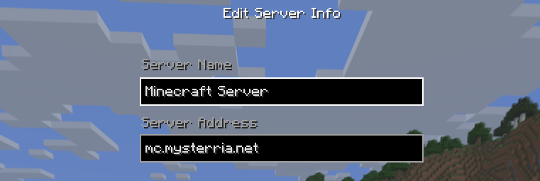
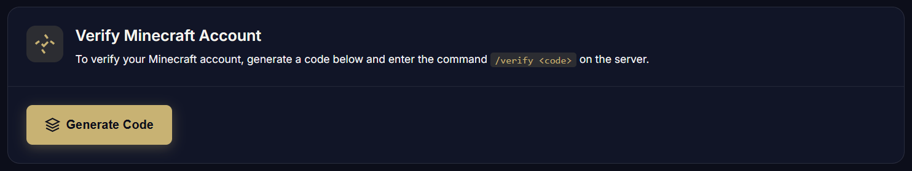
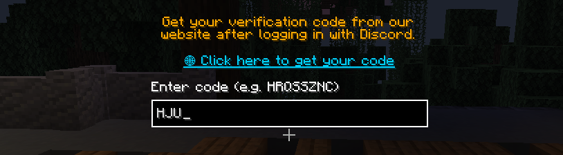
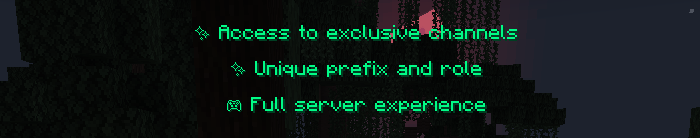

## First steps:

### 1. Connecting to the server
- **Server IP**: `mc.mysterria.net`
- **Minecraft Version**: 1.21.8
- **Server Type**: Vanilla with plugins

### 2. Registration
- Execute the command `/register <password> <password>`
- Remember your password!
- Log in using `/login <password>`

P.S. If you have official Minecraft account, you don't need to register at all!

### 3. Discord Verification
- Get yourself [a verification code here - https://www.mysterria.net/profile](https://www.mysterria.net/profile)

- Enter it in the pop-up window in Minecraft

- You will receive the next bonuses after verifying!

### 3. Newbie Bonus
- You will get a menu with all Pathways in the game

- Choose any, confirm bonus, and confirm once again to clarify your intention
- This will grant you a free Sequence 9 of the pathway! Enjoy it!

### 4. Basic commands
- `/magic` - Next steps on advancing
- `/emporium` - Open the Brilliant Emporium
- `/daily` - Daily rewards for playing on the server
- `/vote` - Open the server voting menu
- `/msg`, `/pm`, `/w` - Send a private message
- `/reply` - Reply to a private message
- `/town` - Open town management menu

### 5. First tasks
1. Explore the lobby. Each NPC has their own dialogue!
2. Familiarize yourself with the server rules and wiki content
3. Create your own or join another town / city
4. Choose your magical Pathway and dive into adventures!

## Useful tips

- Always read the chat — there's lots of useful information there
- Don't hesitate to ask questions in chat! If no one's in chat, they'll help you later!
- Join the Discord community. It has all the latest news, town forums, etc.!
- Learn the magic system gradually. Watch the anime, try reading the web novel!

## Need help?

If you have questions, contact players or administration in chat or Discord!