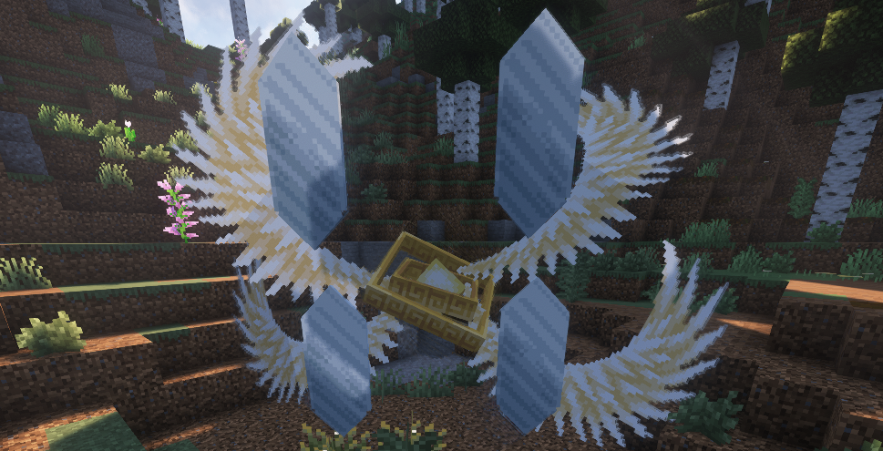
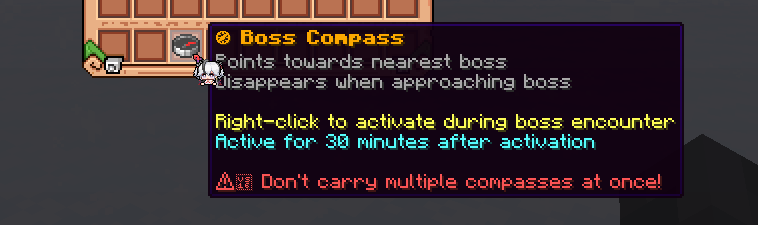

### Who is a Guardian?

A Guardian (or "Boss") is a powerful enemy that can be encountered in the open world. Each of them spawns with a **6-hour** interval at a random location, which will be announced in chat. You will receive corresponding notifications in chat 30, 15, 5, and 1 minute before their appearances.

### What are they for?

If you defeat this powerful Guardian before it disappears on its own, you will receive a special **"Reward Token"** item that looks like this:

Right-click, spin the wheel, and win invaluable rewards that are unique to this Guardian! You can get magical ingredients, recipes, and even characteristics!

### Important things to note

- Battle difficulty increases with the number of players participating
- Reward Tokens can be given to other players or used later
- Bosses have different schedules on weekends than on weekdays
- You can use the "Boss Compass" to search for bosses

P.S. Boss Compass can only be bought in the Store

