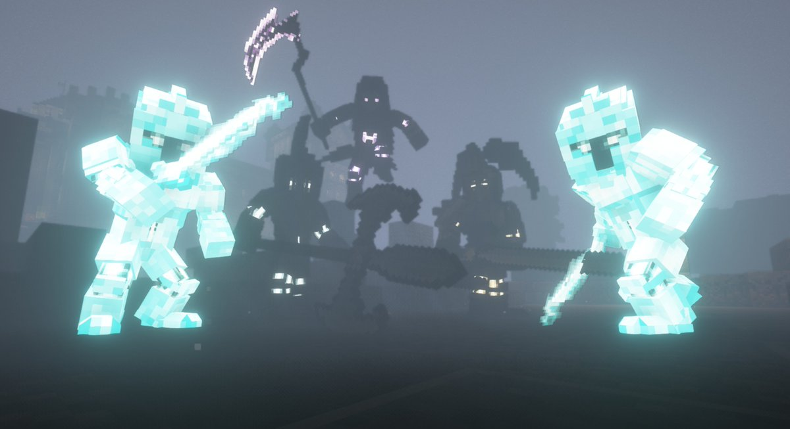
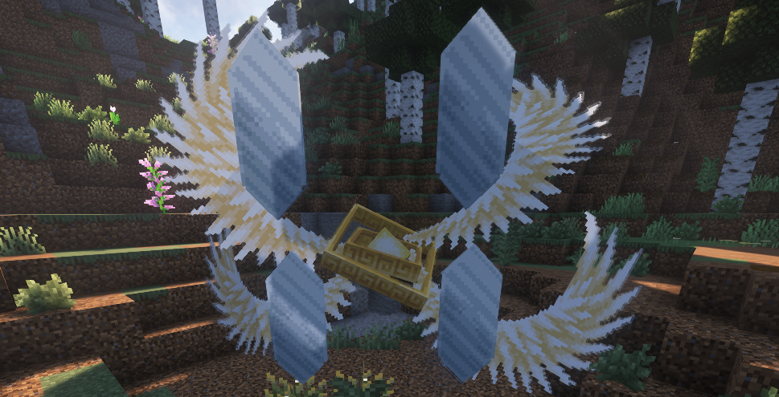
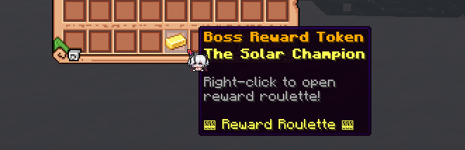
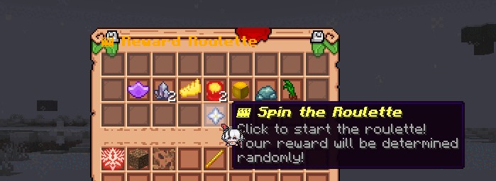
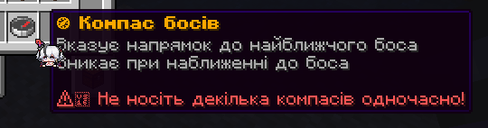

### Who is a Guardian?

A Guardian (or "Boss") is a powerful enemy that can be encountered in the open world. Guardians now **spawn completely randomly** — there is no fixed schedule or location. Keep your eyes open and your gear ready at all times!

---

### What are they for?

If you defeat a Guardian before it disappears on its own, you will receive a special **"Reward Token"** item that looks like this:

Right-click, spin the wheel, and win invaluable rewards that are unique to this Guardian! You can get magical ingredients, recipes, and even characteristics!

---

### Combat mechanics

Guardians are not simple boss fights — they have several phases that change the rules mid-battle:

**Enrage (30% health)**

When a Guardian drops below **30% of its maximum health**, it **enrages**. Its attacks become significantly more powerful and aggressive. Be prepared to adapt your strategy at this threshold.

**Final Phase (below 20% health)**

:::danger[Magic only below 20%]
When a Guardian's health drops below **20%**, it becomes **immune to all physical attacks**. From this point on, only **magic spells** can deal damage to it. If your party has no magic users, the fight may become extremely difficult!
:::

This mechanic makes having at least one Beyonder in your party strongly recommended for Guardian encounters.

---

### Important things to note

- Battle difficulty increases with the number of players participating
- Reward Tokens can be given to other players or used later
- You can use the **"Boss Compass"** to search for active Guardians

P.S. Boss Compass can only be bought in the Store
