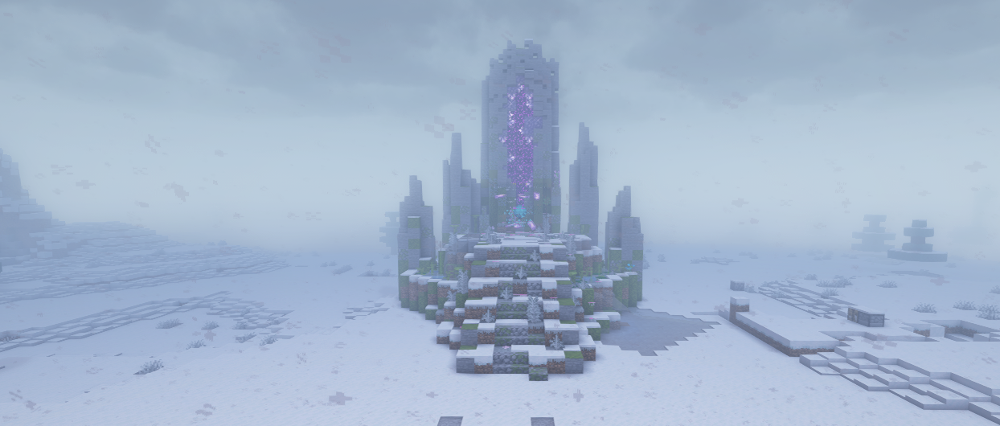

### What is a Dungeon?

A Dungeon is a separate dimension with its own rules, inhabitants, and challenges. A team of several players enters it, receives provided equipment, and must advance forward, gradually defeating enemies in rooms. In the end, a powerful Boss awaits your party, and defeating it grants you the right to emerge victorious from this dimension and take all the earned rewards.

Inside, you can get various recipes and magical ingredients for the pathways. You may also discover rare vanilla Minecraft items such as music discs, enchanted golden apples, and more.

### How to enter one?

To enter, you need to assemble a party using the `/party` command

- **The Alpha Dungeon** requires a party of four players (rewards from 9 to 7 sequence right now)
- **The Beta Dungeon** requires a party of five players (rewards from 9 to 7 sequence right now)
- **The Delta Dungeon** requires a party of four players (rewards from 5 to 6 sequence rn)

Only the party leader needs to travel to the dungeon entrance; the rest of the party can do whatever they want until the dungeon starts. Confirm entrance upon request, wait a little bit to be loaded into a generated for you dungeon instance, choose class equipment and you are ready to go!

### What are Rifts?

To enter the Dungeon itself, you need to find an entrance to it, which is located somewhere in the open world. It looks like a pillar of multicolored particles that gather in an interesting pattern, change color, shimmer, and rise above the center. It may look like this:

Each Rift may also have a sign attached to it with a list of possible rewards, current state, name, and description.

### How to activate a Rift?

To activate a Rift and open a passage through it to the corresponding **Dungeon**, you need to weaken it:

1. Find its location in the world
2. Get close to it, wait for it to knock you back
3. Wait for the message:

> The Node is too strong. You can try to weaken it. [Try?]

4. Click on **[Try?]**
5. Withstand the power of the defensive mechanism

**Energy Fragments** are used for weakening. The weakening progress is shown on the sign attached to it and located near the entrance itself (it's not visible through blocks).

### Rewards and Loot

The rewards for completing a dungeon are **individual** — meaning whoever reaches the loot first gets it. Loot can be found in barrels and chests:
- **Barrels** contain items that help you progress through the dungeon, such as potions and golden apples.
- **Chests** contain rewards you can take out of the dungeon after a successful clear (by defeating the boss within 30 minutes).

You can access your dungeon rewards using the `/rewards` command. Loot remains there till restart **AND WILL BE LOST AFTER**!