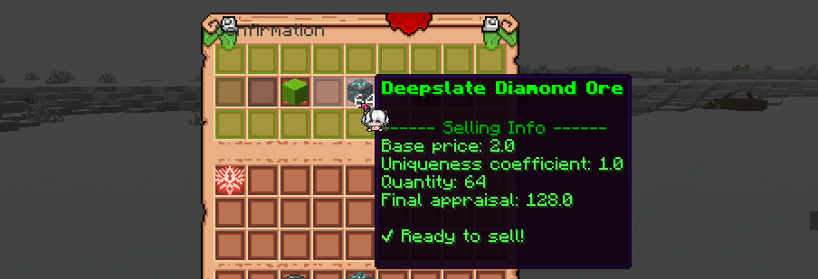

### Why not diamonds?

We want the server's economy to be interesting and match the LoTM setting. Using standard Minecraft currencies can make the economy less engaging and less integrated into the gameplay.

Additionally, standard items have a very strong tendency toward inflation, which can negatively affect the balance of the economy, which after a month or two can become unstable, with very low prices for everything; and the inability to purchase truly important things (for example, Elytra, or some magical ingredients that are key to character development).

### What are server's currencies?

The server has three main currencies:
- Coppet – basic currency for small purchases
- Lick - medium currency for more significant purchases
- Verl d'or – the most expensive currency for special items

**The currency names were taken from the novel "Lord of the Mysteries", specifically from the economic system of the Republic of Intis**

### What is a wallet?

A Wallet is a special item that allows you to store all three currencies in one place. This is convenient for players as they can easily manage their finances without needing to carry separate items for each currency.

#### ✨ Wallet capabilities:

- Storage of all currencies
- Resource conversion to currency
- Item purchases and trade participation

P.S. From certain update and on you can just use command `/wallet`

### What else is the wallet needed for?

Actually, the wallet performs even more functions:
- Used for trading with villagers
- Stores funds and allows receiving currency for completing tasks and participating in events
- Provides the ability to convert resources into currency
- Used to pay for services that require $

> To improve the Town level, you need $300. What is this, where to get it? Actually, everything is very simple – the price is indicated in Coppets. To be able to make the payment, you need to have a wallet with at least 300 Coppets inside.

### How can I make money?

The main way to earn currency (besides trading with other players, of course) is item evaluation.

You can sell resources through the evaluation mechanic:
1. Move the item to the Wallet
2. Get an evaluation in Coppet
3. Confirm the sale or cancel it

**P.S. You can only sell non-renewable ores mined with a pickaxe with "Silk Touch", and not all of them! If you have items in your inventory that can be sold, they will automatically appear in the bottom window of the Wallet.**

**P.S.S.** You can also get money from Battlepass!