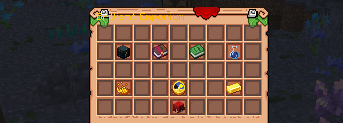
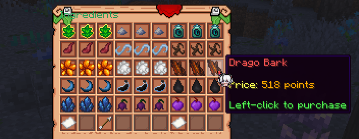
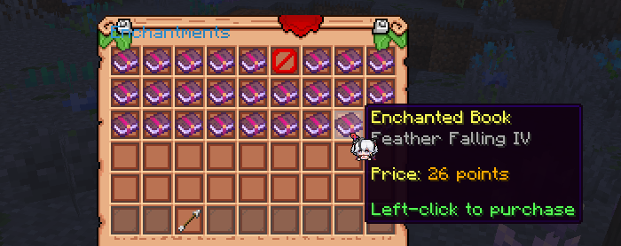
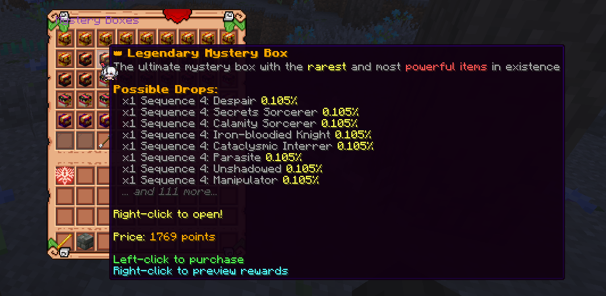

### What is Brilliant Emporium?

**Brilliant Emporium** is a new mechanic that is available for every player on the server. This is a special shop where you can buy unique items that are not available in regular stores, mainly made for magical potions.

The Emporium is available via the command `/emporium` or its alias `/emp`. You can only get its points by **voting for the server**, keeping **daily login streak** and **reporting bugs**.  Its default state looks like this:

### What can you buy there?

The Emporium is divided into five categories:

- Ingredients
- Mystery Boxes
- Enchantments
- Magic Recipes
- Potions

Each category contains a number of items that change from the general pool each day. The final price also changes each day, but the base price stays the same for all items in one category.

The sale limit for each product is limited, first come, first served!

### What are Mystery Boxes?

If you want to try your luck, you can try purchasing a mystery box in the corresponding category. Open it by holding it in your hand and right-clicking. The general set of rewards depends on the box level, but the rewards themselves can be anything!

