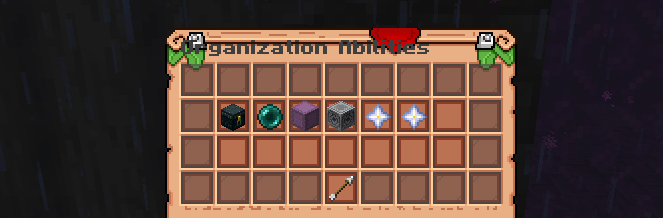
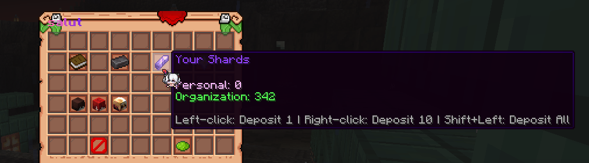

### What are Secret Orders?

Secret organizations are a new mechanic on our server. It allows several players to create their own **Order**, spreading its influence throughout the world.

Secret organizations are a feature available only through donations, which remains active as long as the leader's subscription is active and provides increasing benefits as the organization develops, improving the convenience of interaction and player progress.

### Level and Bonus System

### Level 0 — "Whisper of Mist"

The first level available upon receiving sponsorship and the only one which can be active after sponsorship ends.

> - Up to three members

> - Commands: `/o invite`, `/o kick`, `/o vice set/remove`

> - Magic damage protection between members

> - Private chat `/oc`; Message format: [Organization Name] Nick > message

### Level 1 — "Shadow of Mist"

> - Up to four members

> - **Remote Exchange:** can transfer items between organization members for a performance cost (0.25% – 0.5% per slot)

> - **SOS Signal:** `/o sos` - the coordinates of the user are displayed in the organization chat

### Level 2 — "Gaze of Mist"

> - Up to five members

> - **Pocket Dimension:** access a shared organization meeting space

### Level 3 — "Embrace of Mist"

> - Up to six members

> - **Instant Summon:** summon organization members to yourself instantly

> - **Growth Ritual:** boost organization members' acting gain for 24 hours

> - **Unification Ritual:** pool spirituality among organization members for 10 minutes

### Level 4 — "Heart of Mist"

> - Up to seven members

> - **Secret Lair**: Teleport to the organization's persistent secret base

## Level Improvement

Level improvement occurs through **Energy Shards**, which can be obtained by selling magical ingredients. Each organization will have a common treasury where each member can contribute to reach the next level together.

