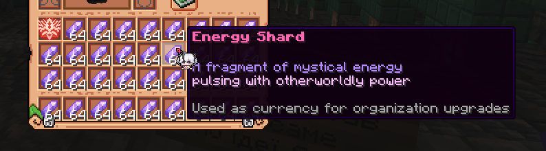
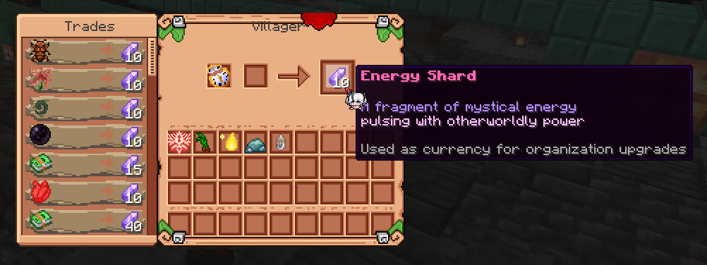

### What are Energy Shards?

Energy Shards are a new currency that looks like this ^

### What are they needed for?

This new currency is needed for many things, such as:
- Upgrading the levels of secret organizations
- Weakening the entrances to dungeons (rifts)
- Paying for the services of Silk Road caravans
- Time-limited seasonal events, etc.

### How to get them?

For this, we need professionless villagers (nitwits), who previously had no purpose. Make sure you have one and right-click him, which will open the next menu:

### What can you sell there?

Each of them can buy some things from you in exchange for an Energy Shard:

- Magical Ingredients of all Sequences
- Magical Recipes of all Sequences 

It is a good way to trade your remaining ingredients and recipes for something more useful! Especially when there is a limited time event, or you want to use them to pay other services