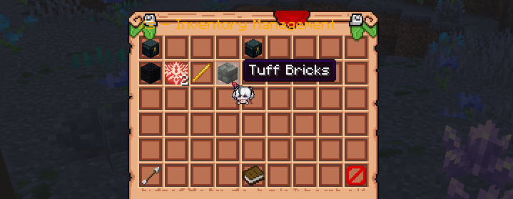
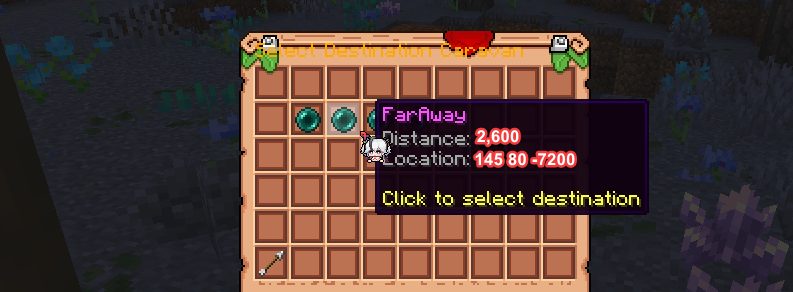

### What is The Silk Road?

The Silk Road is a mechanic which allows players to create trade routes between large cities using caravans for long
distances, without spending time on travel or building subway highways. Here's how it works:

### How to create a Caravan Post

Players have to build a special post on the territory near their city.

- The post must be on the territory within a valid city of at least **level 2**
- The post must be appropriately designed and meet visual requirements
- The post must match the city's theme and generally look good

Administrators will convert them into official caravan posts upon request.

### Sending a caravan

1. Residents open the GUI at the official post using `/caravan`
2. Put items you want to send to another town in a corresponding menu

   
3. Choose a destination city from the list of large cities with posts

   
4. Pay the required amount of **Energy Shards** to confirm the delivery
5. Done. Another post will receive your parcel after some time!

### Receiving goods

- After the established travel time, the caravan arrives at the destination post
- Members of the destination city can pick them up from their own post with no fee

This system encourages trade, cooperation, and strategic planning between cities.  And no more need to dig stone, digging kilometer-long subway branches just to trade!