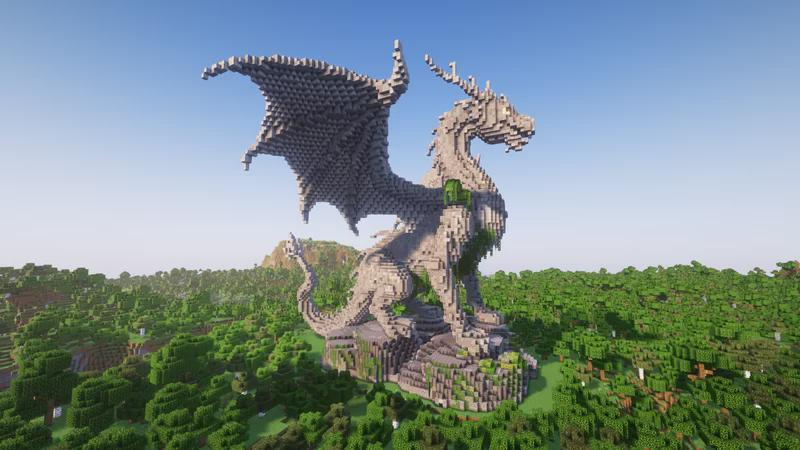
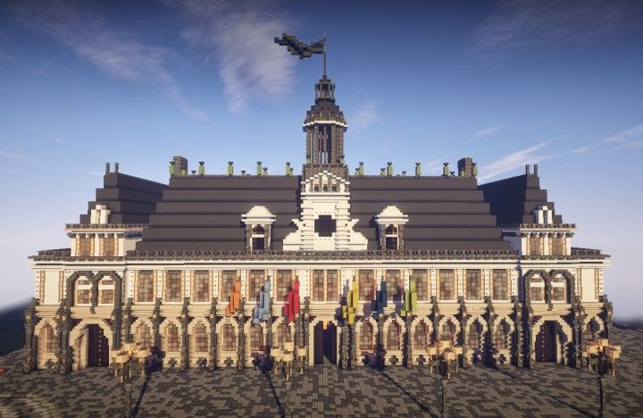

### Creating a Town
```
/lands create <town_name>
```
Creating a town costs **32 coppets** and immediately claims the chunk you're standing in.

### Basic Town Commands
- `/lands` — open your town menu
- `/lands trust <player>` — invite a player to your town
- `/lands untrust <player>` — remove a player from your town
- `/lands setrole <player> <role>` — assign a role to a member
- `/lands ban <player>` — permanently ban a player from your town
- `/lands rename <name>` — rename your town (costs 10,000 coppets, 1 day cooldown)
- `/lands delete` — disband your town
- `/lands transfer <player>` — transfer ownership to another player

### Claiming Land
- `/claim` — claim the chunk you are standing in
- `/unclaim` — unclaim the chunk you are standing in

Every claimed chunk costs **3 coppets per week** in upkeep (see [Upkeep](#upkeep) below). New towns are exempt from their first upkeep payment.

### Entry / Exit Messages
- `/lands greeting <message>` — set the entry message for your territory
- `/lands farewell <message>` — set the exit message from your territory

### Economic Commands
- `/lands deposit <amount>` — deposit funds into the town treasury
- `/lands withdraw <amount>` — withdraw funds from the treasury (Owner only)

---

## Town Roles

Every town has a hierarchy of roles. Each role controls what players of that group can do inside the town's territory.

| Role | Who | Default Permissions |
|---|---|---|
| **Owner** | Town founder | Everything |
| **Admin** | Trusted officers | Build, break, interact, manage members and roles |
| **Member** | Regular residents | Build, break, interact, farm |
| **Nation** | Members of an allied nation | Interact, move through, claim border chunks |
| **Ally** | Members of allied towns | Interact, move through |
| **Untrusted** | Any visitor | Enter, pick up items, attack monsters |

By default, **PvP is disabled** in all towns for all roles. A town owner can enable it per-role in the town menu (e.g., to set up a PvP arena inside their territory).

---

## Upkeep

Towns pay **3 coppets per claimed chunk, per week**. The payment is drawn automatically from the town treasury every Sunday at 23:00. If a town cannot cover its upkeep, members who can deposit will receive reminders 2 days in advance.

Make sure your treasury always has enough funds — a well-funded town is a stable town.

---

## Town Levels

As your town grows, it automatically advances through levels based on its member count and treasury balance. Higher levels unlock a larger maximum territory size.

| Level | Name | Members Required | Balance Required |
|---|---|---|---|
| 1 | **Shelter** | — | — |
| 2 | **Hamlet** | 4 | 7,500 coppets |
| 3 | **Parish** | 8 | 17,000 coppets |
| 4 | **Borough** | 14 | 30,000 coppets |
| 5 | **Domain** | 24 | 55,000 coppets |

Levels are assigned **automatically** once all requirements are met. A town that later drops below the requirements will be downgraded.

---

## Nations

Once a town reaches level 5 (**Domain**), its owner may found a **Nation** — a union of multiple towns under a shared banner.

```
/nations create <name>
```
Founding a Nation costs **20,000 coppets**.

Nations progress through their own levels as member towns and combined treasury grow:

| Level | Name | Lands Required | Members Required | Balance Required |
|---|---|---|---|---|
| 1 | **Covenant** | — | — | — |
| 2 | **Order** | 3 | 32 | 100,000 coppets |
| 3 | **Dominion** | 6 | 64 | 250,000 coppets |

Higher nation levels grant **passive effects** to all members (speed, haste, jump boost, and more), with stronger effects and more simultaneous buffs unlocked at each tier.

Nation members can be granted special permissions in each town's territory through the **Nation** role — each town controls this independently.

---

## Wars

Towns and Nations can declare war on one another. War is always **mutual** — both sides must agree before it begins.

```
/wars declare <town>   — declare war on another town
/wars deny             — reject an incoming declaration
/wars                  — open the war menu
```

**How wars work:**
- After both sides accept, a **1-day preparation period** begins before fighting starts.
- Attackers can place **Capture Flags** (beacons) on the border of enemy territory. Holding a capture point for 10 minutes unclaims that chunk.
- The team that accumulates the most points (kills + captures) wins.
- The losing side pays the winner **up to 75%** of their treasury as tribute.
- After a war ends, both sides receive a **7-day peace shield** during which they cannot be attacked again.

Wars can only be fought between towns with enough members and resources — a small, newly-founded Shelter cannot simply be declared on by a powerful Domain.

---

## Why Develop a Large Town?

Large towns that undertake ambitious construction projects can request a **special permanent effect** tied to their creation. A few examples:

> Town **N** built a towering **Dragon** statue. The majesty of the mighty dragon so influenced the surrounding lands that almost all evil monsters vanished from the town's territory.


> Town **K** raised a grand **cathedral** at the heart of their city. The sight so lifted the spirit of its residents that within the city's borders they regenerate health and stamina faster than anywhere else.


These effects are awarded at admin discretion for exceptional builds that enrich the world. No subscription required — just vision and effort.
