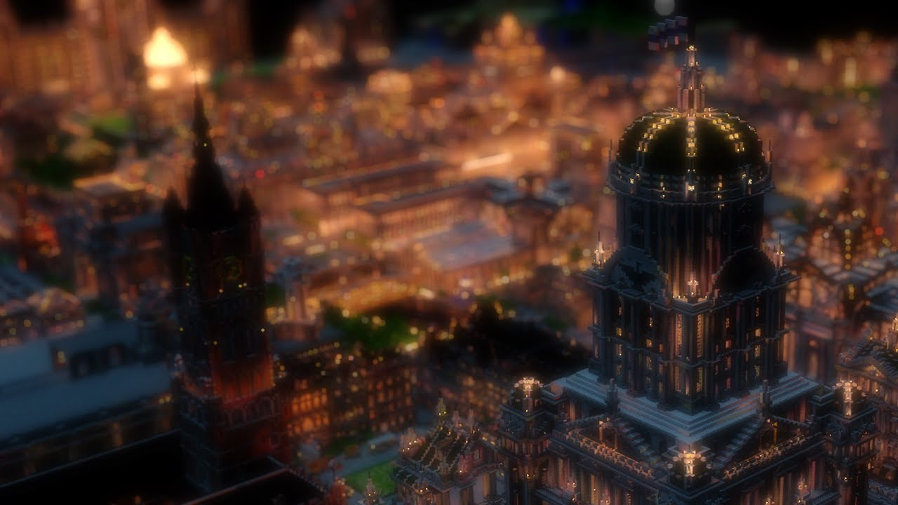

### What are Town Perks?

Town Perks are unique, custom-coded buffs granted to towns that complete massive architectural projects. Unlike standard town features, these are manually evaluated and applied by admins to reward creativity, scale, and active community building.

### How it Works

1.  **Build** - Create an impressive structure (e.g., a Cathedral, a Great Library).
2.  **Submit** - Open a support ticket in Discord with coordinates and screenshots.
3.  **Evaluation** - Admins assess the build quality, town level, and population.
4.  **Activation** - If approved, a custom AOE buff is applied to your territory.

---

### Perk Tiers & Requirements

Not all perks are available to every town. The more advanced your settlement is, the more powerful the "spiritual" and "physical" resonance of your builds becomes.

| Perk Icon | Perk Name | Min. Level | Min. Players | Architectural Requirement |
| :--- | :--- | :---: |:------------:| :--- |
| 🌾 | **Agriculture** | **Lv. 2** |      5       | A dedicated greenhouse or functional barn. |
| 🛡️ | **Mob Protection** | **Lv. 4** |      12      | Completed defensive walls or a central guard tower. |
| 🧪 | **Potion Effects** | **Lv. 5** |      18      | An Alchemy Lab or Brewery with detailed interiors. |
| ✨ | **Experience Boost** | **Lv. 6** |      22      | A Library or Academy containing at least 200 bookshelves. |
| 🛠️ | **Armor Repair** | **Lv. 8** |      30      | A massive Forge or Industrial District with "machinery". |
| 🎭 | **Acting Boost** | **Lv. 10** |      40      | A Grand Theatre or Arena. Requires 3+ Demigods. |
| 🌀 | **Spirituality** | **Lv. 10** |      45      | A Cathedral or Pathway Temple. Requires 5+ Demigods. |

> [High-Tier Requirement]

**Spirituality and Acting perks** are the rarest and most difficult to obtain. These require the town to be a true hub for high-sequence Beyonders. To qualify, your build must reflect the mystical nature of the pathways residing there.

---

### Available Buff Types

> **🛡️ Mob Protection** - Prevents hostile mob spawns within the designated area.

> **🧪 Potion Effects** - Grants continuous effects like Speed, Haste, or Night Vision.

> **🌾 Enhanced Agriculture** - Significantly increases the growth speed of crops.

> **🛠️ Armor Restoration** - Slowly repairs the durability of worn armor over time.

> **✨ Experience Boost** - Multiplies the XP gained while within town borders.

> **🎭 Acting Enhancement** - Increases acting points gained from using abilities.

> **🌀 Spiritual Regeneration** - Drastically increases the rate of spirituality recovery.

### Territory Customization

Depending on the build, buffs can be applied in different shapes:
- **Radius**: A circular zone around a central monument.
- **Rectangle**: Specifically covering a town square or hall.
- **Global**: Covering the entire claimed territory (reserved for Lv. 10 towns).

---

### Tips for Approval

1. **Thematic Consistency** - A giant dragon should grant protection or damage buffs, while a cathedral should grant spirituality or healing.

2. **Scale Matters** - Small houses won't qualify. We are looking for "World Wonder" style projects that define the server's landscape.

3. **Completion** - Do not submit unfinished builds or "shells" without interiors. Quality is checked both inside and out!