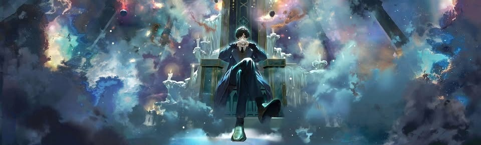

### What are boons?

Unlike the standard potion system, where your power comes from within, this power comes from another entity. We will not name him here.

Boon is effectively a bestowed Sequence, which you can have in parallel to your normal one. It will grant you its own spells, have its own acting progression and will increase your max spirituality

### How to get one?

Right now the only way to get one is to be **useful** to him.

It can be different things:
- Helping to test some new features
- Working as a mod or admin, resolving common issues
- Spreading the word about the server on TikTok / YouTube
- Boosting the Discord guild with Nitro
- ...etc

### How to progress boons?

You can't progress.

The only way you can get more from it is by using its spells to increase acting - in order to get more spirituality, but that's it. Each boon only gives you one Sequence from pathways of ~~Outer Deities~~, and can't be progressed further.

At least, for now.