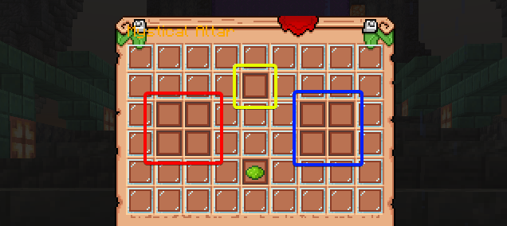

---

### Who is a Beyonder?

A **Beyonder** is a player who has drunk a magical potion and gained extraordinary abilities. Want to become one of them? Then you'll need a **Magic Cauldron** and the right ingredients!

---

### What is a Magic Cauldron?

To brew magical potions, you need to create a **Magical Cauldron**. This is a special multi-block structure that you must **build yourself**. Once it is assembled, you will be able to interact with the cauldron!

There are **three tiers** of Magic Cauldrons, each more difficult to construct than the last:

| Tier | Name | Effect |
|------|------|--------|
| 1 | Crude Cauldron | Lowest brew success chance |
| 2 | Normal Cauldron | Standard brew success chance |
| 3 | Advanced Cauldron | Highest brew success chance |

:::tip[Finding Blueprints]
The blueprint for building a cauldron can be found in **loot containers** scattered throughout the world. Press **LMB** on the found blueprint to place the structure and follow the instructions in the chat!
:::

---

### What are Sacrificial Altars?

In addition to Magic Cauldrons, there are also **Sacrificial Altars** — separate structures used for a completely different purpose (such as advancing Boons). Like cauldrons, they come in three tiers:

- **Crude Sacrificial Altar**
- **Normal Sacrificial Altar**
- **Advanced Sacrificial Altar**

Their blueprints can also be found in loot containers throughout the world.

---

### What are Beyonder Ingredients?

To create a magical potion, you will need **main** and **supplementary** Beyonder ingredients. Usually, these are **Beyonder items** that can be found or obtained by meeting certain conditions.

Which ones exactly? You'll have to find that out **on your own!** Different items come from different sources!

---

### What is Beyonder Char?

**Beyonder Char** is a special item that can **replace all main ingredients** in a potion recipe at once.

For example, if a potion requires **3 different main ingredients**, a single set of Chars can replace all of them entirely.

Beyond brewing, Beyonder Chars have additional uses:
- They are used to craft **Sealed Artifacts**
- Some pathways can **consume** them directly for special effects

:::tip[Beyonder Characteristics]
You may also come across regular **Beyonder Characteristics** — colored orbs / player heads — in the world. These function similarly but are a separate category of item.
:::

---

### What are Beyonder Recipes?

To brew a potion, you need to know the correct combination of ingredients.

**Where to find recipes?**

In the open world, you can find **complete recipes** — ancient books with a full list of the necessary ingredients. They are usually found in **loot containers** discovered during your travels.

You may also find **separate recipe pages** — individual fragments of a recipe. These come in **three subtypes**, matching the three component groups of a finished recipe:

- **Main Ingredient Pages**
- **Supplementary Ingredient Pages**
- **Ritual Pages**

**Every page tells you its own subtype and its own progress count** — a page will read something like *"Main Ingredient Page 2/3"*. You can therefore always see exactly which subtype you are still missing and how many more of it you need.

Each page can be **read on its own** for partial knowledge. Once you have collected every page across all three subtypes, **combine them at a crafting table** to form a complete recipe book!

---

### What are Beyonder Rituals?

Every player has a **unique, randomly assigned ritual**. Ritual requirements usually appear as advancements.

:::tip[Your first potion needs no ritual]
**Reaching Sequence 9 requires no ritual at all.** You can drink your very first potion freely, with no ritual completed and no Madness gained. Rituals only start to matter when you advance *beyond* Sequence 9.
:::

When advancing to **Sequence 8 through 6**, the ritual is optional — but skipping it **increases your Madness**, including a permanent component that can never be removed. When advancing to **Sequence 5 or stronger**, completing the ritual is **mandatory**.

See [Mutation](/magic/mutation) for the exact costs.

---

### Potion Expiration

Brewed potions **do not last forever**. Each potion has an expiration period of **2 real-time days** from the moment it first appears in the world.

:::danger[Warning]
After 2 days, an unused potion will automatically transform into a **random Sealed Artifact**. Make sure to use it in time!
:::

---

### How to Become a Beyonder?

To become a Beyonder, follow these steps:

1. **Find** a complete recipe or combine separate pages at a crafting table.
2. **Build** the Beyonder Cauldron using its blueprint.
3. **Gather** all the necessary main and supplementary ingredients (or Beyonder Chars to replace the main ones).
4. **Complete** your personal ritual, if one applies — not needed for your first Sequence 9 potion.
5. **Place** the components in the cauldron:

- **Main** ingredients (or Chars) - on the **left** 🔴
- **Supplementary** ingredients - on the **right** 🔵
- **Recipe** - in the **center** 🟡

:::tip[Pay attention]
For the cauldron to work, the ingredients must be placed in the same order as they are listed in the recipe. A higher-tier cauldron improves your chances of a successful brew!
:::

If everything is done correctly - a **potion** will appear in your inventory, which you can drink to gain powers. If something goes wrong - the ingredients will remain in place, and the potion **will not be created**!
