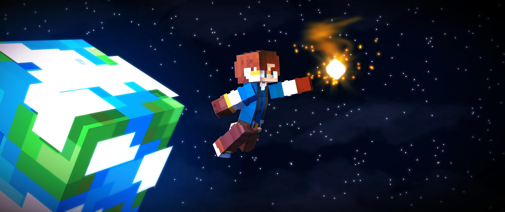
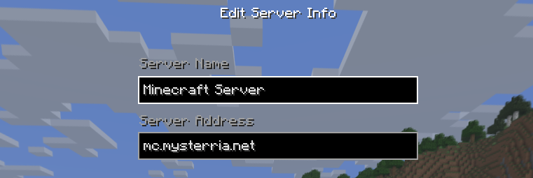
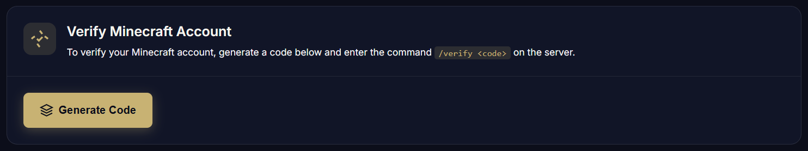
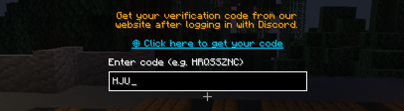
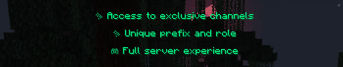
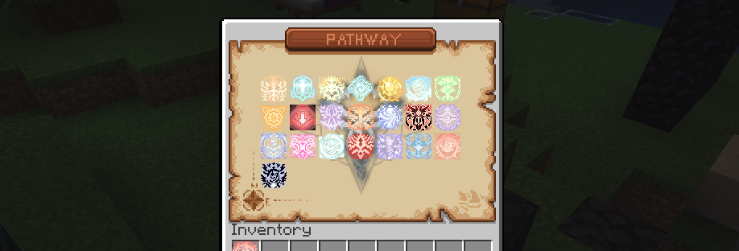

## Перші кроки:

### 1. Підключення до сервера
- **IP сервера**: `mc.mysterria.net`
- **Версія Minecraft**: 1.21 - 26.1.2
- **Тип сервера**: Vanilla з плагінами

### 2. Реєстрація
- Виконайте команду `/register <пароль> <пароль>`
- Запам'ятайте свій пароль!
- Увійдіть, використовуючи `/login <пароль>`

P.S. Якщо у вас офіційний акаунт Minecraft, вам взагалі не потрібно реєструватися!

### 3. Верифікація в Discord
- Отримайте [код верифікації тут - https://www.mysterria.net/profile](https://www.mysterria.net/profile)

- Введіть його у спливаючому вікні в Minecraft

- Після верифікації ви отримаєте такі бонуси!

### 3. Бонус для новачків
- Ви отримаєте меню з усіма Шляхами в грі

- Оберіть будь-який, прийміть рішення про шлях, яким ви збираєтеся йти, і підтвердіть ще раз.
- **Шлях Рішучості** надасть вам випадковий Рецепт із наступного знайденого контейнера.
- **Шлях Скорочення** одразу надасть вам 9-ту Послідовність, але також і постійний дебафф.
- Це надасть вам безкоштовну 9-ту Послідовність обраного шляху! Насолоджуйтесь!

### 4. Основні команди
- `/magic` — Наступні кроки для просування.
- `/emporium` — Відкрити Діамантовий Емпоріум.
- `/daily` — Щоденні нагороди за гру на сервері.
- `/vote` — Відкрити меню голосування за сервер.
- `/msg`, `/pm`, `/w` — Надіслати приватне повідомлення.
- `/reply` — Відповісти на приватне повідомлення.
- `/town` — Відкрити меню керування містом.

### 5. Перші завдання
1. Дослідіть лобі. Кожен NPC має свої діалоги!
2. Ознайомтеся з правилами сервера та вмістом вікі.
3. Створіть власне або приєднайтеся до іншого міста.
4. Оберіть свій магічний Шлях і пориньте в пригоди!

## Корисні поради

- Завжди читайте чат — там багато корисної інформації.
- Не соромтеся ставити запитання в чаті! Якщо в чаті нікого немає, вам допоможуть пізніше!
- Приєднуйтесь до спільноти Discord. Там усі останні новини, форуми міст тощо!
- Вивчайте магічну систему поступово. Подивіться аніме, спробуйте почитати веб-новелу!

## Потрібна допомога?

Якщо у вас виникли запитання, звертайтеся до гравців або адміністрації в чаті чи Discord!
