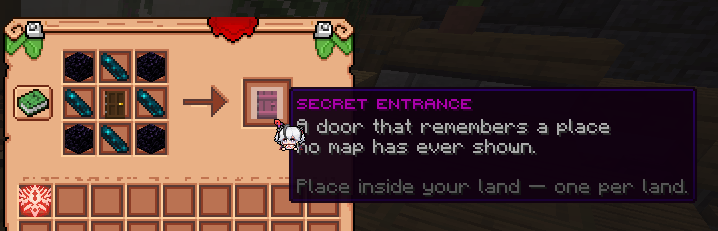
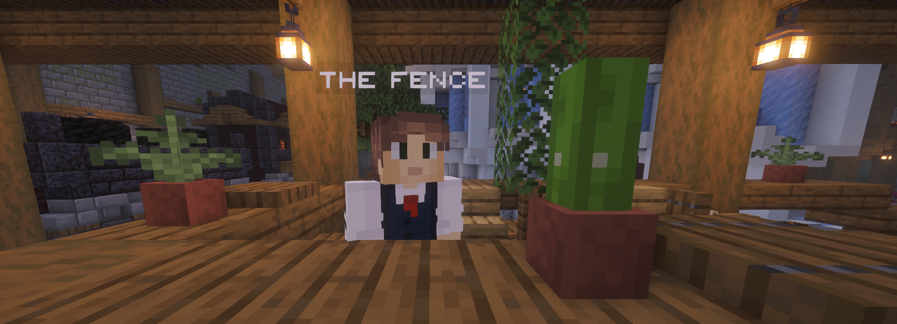
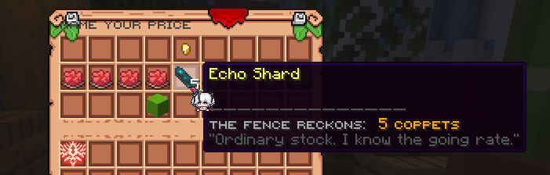
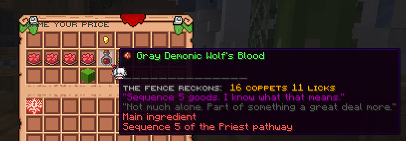
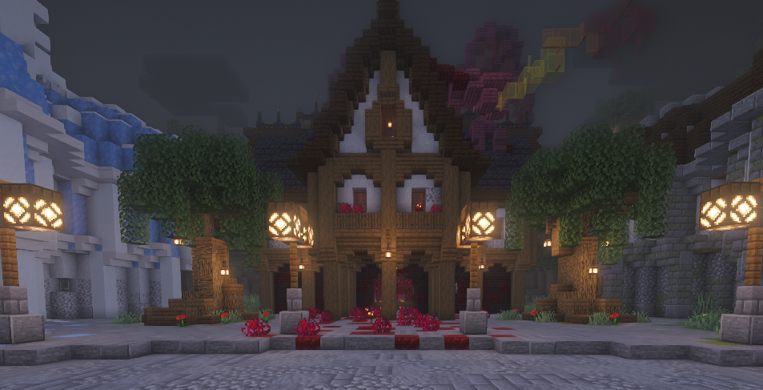

**Агора** - це ринок, якого немає на жодній мапі. Він лежить під світом, потрапити до нього можна лише крізь приховані
двері, і саме там гравці торгують з гравцями - ніколи не зустрічаючись і не знаючи імен одне одного.

Для Агори **немає жодних команд**. Усе відбувається особисто: ви проходите крізь двері й розмовляєте з тими, хто там
працює.

---

## Як потрапити всередину

### Скрафтіть Таємний вхід

```
O E O        O - Обсидіан
E D E        E - Уламок відлуння
O E O        D - Двері з темного дуба
```



### Встановіть його

Натисніть ПКМ по блоку, тримаючи вхід у руці. Кілька умов:

- Над місцем потрібно **два блоки вільного простору**.
- Воно має бути на **заявленій землі міста**, і ви маєте бути там **довіреним** (trusted).
- **Один вхід на одну землю** - земля, що вже приховує двері, відмовить у других.

Стіна здригнеться - і ваші двері з'являться. Натисніть по них ПКМ, щоб спуститися.

Не хочете будувати власний? Сервер утримує **публічний вхід** на координатах `(0, 0)`, і скористатися ним може будь-хто.

### Це таємниця, а не замок

Будь-хто, хто знайде ваші двері, зможе крізь них пройти. Ховайте їх добре.

Самі двері в безпеці - їх не можна зламати, підірвати чи зрушити. Єдиний спосіб їх позбутися - зняти заявку із землі,
на якій вони стоять: двері зникнуть разом із нею. Так само їх і переносять - зніміть заявку з чанка, заявіть його знову,
а тоді поставте свіжий вхід там, де вам зручніше. Старі двері не повернуться, тож перенесення означає новий крафт.

### Як вибратися назад

Знайдіть **двері виходу** та натисніть по них ПКМ. Ви опинитеся рівно там, звідки спускалися.

---

## Усередині Агори

- Тут нікому не можна завдати шкоди. Ні PvP, ні мобів, ні шкоди від падіння, ні вибухів, ні вогню.
- Ваш інвентар належить вам. Біля дверей у вас нічого не забирають - ні туди, ні назад.
- Будувати чи відкривати скрині будь-де на ринку не можна - окрім як усередині [ятки](#ятки), яку ви орендуєте.

---

## Кого ви зустрінете

Натисніть ПКМ по будь-кому, щоб поговорити.

| Хто                    | Для чого                                 |
|------------------------|------------------------------------------|
| **Перекупник**         | Виставити ваші товари на продаж          |
| **Базарний клерк**     | Переглядати й купувати                   |
| **Інформатор**         | Пошук за Шляхом і Послідовністю          |
| **Хранитель книги**    | Забрати свої покупки та свої гроші       |
| **Кур'єрський пост**   | Замовити доставку покупок                |
| **Наглядач ділянок**   | Орендувати ятку                          |
| **Господар ятки**      | Власна вітрина орендаря                  |
| **Квартирмейстер**     | Звичайна крамниця, перенесена під землю  |



---

## Гроші

Усе тут рахують трьома монетами:

| Монета         | Вартість                     |
|----------------|------------------------------|
| **Коппет**     | Найдрібніша монета           |
| **Лік**        | 64 коппети                   |
| **Верльдор**   | 64 ліки, або 4 096 коппетів  |

Ціну називають тією сумішшю, що читається найкоротше - `16 коппетів 11 ліків` замість 720 коппетів. Там, де ціну
вводите ви самі, скорочення такі: `c` - коппети, `l` - ліки, `v` - верльдори.

---

## Продаж

Передайте предмет **Перекупнику** й назвіть ціну. Спершу він оцінить його та підкаже, скільки, на його думку, той
вартий - матеріали Потойбічних оцінюються за Послідовністю, звичайні товари - за тим, почім останнім часом продавалося
схоже. Це лише порада. Ціну встановлюєте ви.

| Умова                  | Значення                                                |
|------------------------|---------------------------------------------------------|
| Комісія за виставлення | **2%** від вашої ціни (щонайменше 1 коппет)             |
| Податок з продажу      | **8%** від угоди                                        |
| Діапазон цін           | 1 коппет – 1 000 000 коппетів (244 верльдори 9 ліків)   |
| Нових лотів на день    | **5**                                                   |
| Активних одночасно     | **15**                                                  |
| Лот тримається         | **72 години**                                           |

Комісія сплачується **наперед** і не повертається - ні якщо предмет продався, ні якщо термін минув, ні якщо ви скасували
лот. Обирайте ціну обачно.




**Деякі речі продати не можна:** шалкерові скрині, торбинки та будь-що інше, що вміщує предмети; бедрок; а також
прив'язані до вас предмети.

### Коли щось продалося

Вам не скажуть, що саме й за скільки - лише те, що на ваше ім'я відкладено монету. Рахувати - робота Хранителя книги, і
по неї доведеться прийти.

Продажі, що сталися, поки вас не було, чекатимуть на вас при наступному вході.

### Коли не продалося

За 72 години непроданий лот згасає, і предмет потрапляє до вашої **схованки**. Скасуєте лот раніше - він потрапить туди
ж. У будь-якому разі ви отримаєте його назад.

---

## Купівля

**Базарний клерк** покаже все, що є в продажу. **Інформатор** - для випадків, коли ви точно знаєте, що шукаєте: пошук за
Шляхом і Послідовністю.

<!--  -->

Ви платите ціну на ціннику й нічого понад те - податок стягується з частки продавця, не з вашої. Власний лот купити не
можна.

Покупки **не потрапляють до інвентаря**. Вони чекатимуть на вас у Хранителя книги - якщо ви не найняли
[кур'єра](#курєри).

---

## Як забрати своє

Усе, що ринок вам винен, лежить у **Хранителя книги**, доки ви по це не прийдете. Воно не згасає й ніколи не приходить
саме.

<!--  -->

**Ваша схованка** зберігає предмети: куплене, лоти, термін яких минув, скасовані лоти, а також усе врятоване з втраченої
ятки. Забирайте стільки, скільки вміщує інвентар - решта залишиться в безпеці.

**Ваша книга** зберігає гроші: кожен ваш продаж і те, скільки він приніс після податку. Отримання виплачує все, що
винні, одразу.

---

## Кур'єри

Набридло щоразу спускатися по покупки? Принесіть **ріг виклику** до **Кур'єрського посту** й залиште його там. Відтоді
все куплене доставлятимуть просто вам.

Один ріг за раз. Заберіть його будь-коли - і доставка припиниться.

---

## Ятки

**Ятка** - це кімната на ринку, яку можна орендувати, забудувати й торгувати з неї. Зверніться до **Наглядача
ділянок**, щоб узяти одну.



| Умова           | Значення                            |
|-----------------|-------------------------------------|
| Оренда          | **5 верльдорів** (20 480 коппетів)  |
| Період          | **7 днів**                          |
| Яток на гравця  | **1**                               |
| Пільговий строк | **48 годин**                        |

Поки оренда сплачена, ви можете будувати, ламати й користуватися скринями **всередині своєї ятки**. Біля вітрини
з'явиться **Господар ятки** - відвідувачі, натиснувши по ньому, побачать ваші товари, а ви - власний прилавок.

### Як її втримати

Заплатіть Наглядачеві ділянок ще раз, доки тиждень не сплив, щоб продовжити оренду. Не встигнете - матимете **48 годин
пільгового строку**: ви нічого не втрачаєте, але вам нагадуватимуть.

### Як її втратити

Після цього вас виселять, але **нічого не буде знищено**. Усе зі скринь, ваші рамки, стійки для броні, будь-що залишене
на підлозі - все потрапить до вашої схованки в Хранителя книги, а кімнату підготують для наступного орендаря.

Ятку також можна повернути достроково через меню Наглядача ділянок.

---

## Прилавки

Усередині власної ятки можна поставити **прилавки** - табличку на скрині, що продає всім перехожим без комісії за
виставлення й без очікування. До **12 на ятку**.

<!--  -->

1. Поставте скриню, а на неї - табличку: на грані або згори.
2. **Рядок 1:** `[Market]`
3. **Рядок 2:** ціна - просте число коппетів або скорочення на кшталт `3v 12l 5c` (3 верльдори, 12 ліків і 5 коппетів -
   разом 13 061 коппет).
4. **Рядок 3** *(за бажанням)*: скільки предметів за одну покупку, 1–64. Залиште порожнім для 1.
5. **Натисніть ПКМ по табличці, тримаючи предмет, який хочете продавати.**

Табличка перемалює себе, показавши предмет, ціну та ваше ім'я.

| Дія                      | Результат                             |
|--------------------------|---------------------------------------|
| ПКМ із предметом у руці  | Встановити або змінити, що продається |
| ПКМ порожньою рукою      | Перевірити запас і скільки продано    |
| Крадькома + ПКМ          | Закрити прилавок                      |

**Скриня - це ваш запас.** Поповнення - це просто покласти більше; коли вона порожня, прилавок розпродано. Щоб змінити
ціну, зламайте табличку й налаштуйте прилавок наново.

**Щоб купити:** натисніть ПКМ по табличці один раз, щоб побачити ціну, і **ще раз протягом 6 секунд**, щоб заплатити.
Предмети одразу потраплять вам до рук.

Прилавок зникає разом із табличкою, скринею або яткою.

---

## Скільки це коштує

| Що                | Ціна                                        |
|-------------------|---------------------------------------------|
| Таємний вхід      | Обсидіан, уламки відлуння, двері            |
| Виставлення лоту  | 2% від вашої ціни (мін. 1 коппет)           |
| Продаж предмета   | 8% від угоди                                |
| Купівля предмета  | Ціна на ціннику                             |
| Оренда ятки       | 5 верльдорів (20 480 коппетів) на тиждень   |
| Доставка кур'єром | Безкоштовно - ріг і є платою                |

---

## Варто пам'ятати

- **Ніхто не знає, хто ви.** На лотах немає імен. У цьому вся суть.
- **Ніщо не прийде саме.** Покупки й заробіток чекають у Хранителя книги, доки ви по них не прийдете - або доки цього не
  зробить кур'єр.
- **Ніщо не втрачається.** Згасле, скасоване, виселене - усе опиняється у вашій схованці.
- **Комісія зникає в мить виставлення лоту.** Подумайте, перш ніж ставити ціну.
