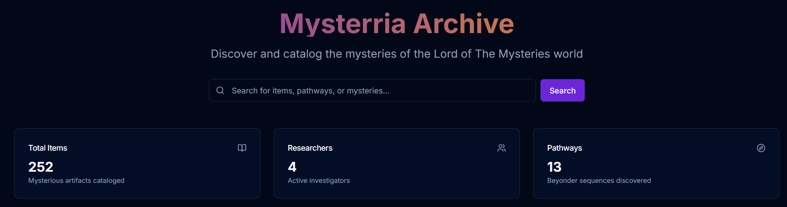
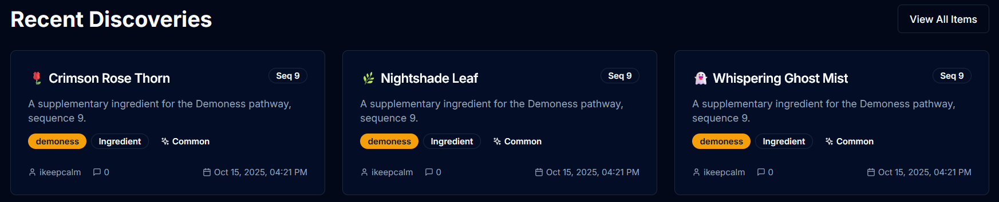

### Що таке Архів?

Архів — це окремий майданчик, створений спеціально для потреб сервера. По суті, це окремий форум, де гравці можуть обмінюватися інформацією, ділитися своїми відкриттями, переглядати знахідки інших гравців та залишати коментарі з уточнюючою інформацією про інгредієнт, монстра чи інші нові механіки.

Архів доступний за адресою: [https://archive.mysterria.net](https://archive.mysterria.net)

### Як ним користуватися?

Все **дуже і дуже** просто. Вам потрібно:

1. Перейти на [https://archive.mysterria.net](https://archive.mysterria.net).
2. Зареєструватися або увійти, якщо у вас вже є акаунт на основному сайті [https://www.mysterria.net](https://www.mysterria.net).
3. Обрати категорію, яка вас цікавить, наприклад, «Інгредієнти».
4. Обрати підкатегорію, наприклад, «Незвичайні».
5. Знайти потрібний інгредієнт, наприклад, «Перо Фенікса».
6. Переглянути інформацію про нього, прочитати коментарі інших або залишити свій власний.

### Як я можу щось туди додати?

Якщо ви хочете додати щось нове до Архіву, наприклад, інформацію про новий інгредієнт, вам потрібно:
1. Зареєструватися або увійти на [https://archive.mysterria.net](https://archive.mysterria.net).
2. Натиснути кнопку «Додати предмет» (Add Item) у верхньому правому куті.
3. Заповнити форму, додати зображення, опис, обрати категорію та підкатегорію.
4. Натиснути «Створити предмет» (Create Item) та заповнити всі поля.

Якщо ваша інформація буде корисною та цікавою, вона буде опублікована в Архіві, і інші гравці зможуть її переглядати та коментувати. Сам предмет відображатиметься у вашому профілі Архіву.
