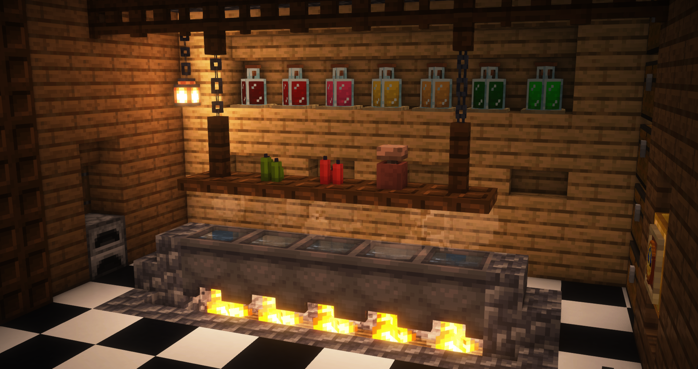
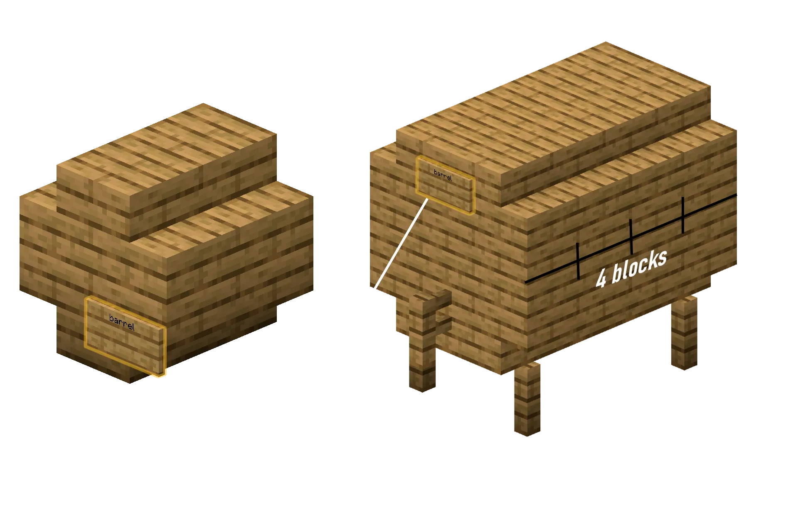

### Що таке Броварня?

Система **Броварні** додає на сервер процес ферментації та дозрівання напоїв. Тепер ви можете виготовляти звичайні
алкогольні напої, особливі види кави та потужні **живильні напої**, які дають насичення і повністю замінюють тверду їжу.

Однак надмірне вживання алкоголю призводить до хитання, спотвореної мови, скаламученого тексту на табличках і важкого похмілля!

---

### Як це працює

Шлях від сирих інгредієнтів до ідеального напою з 5 зірками складається з чотирьох окремих етапів:

- **Ферментація** - Закип'ятіть інгредієнти в розігрітому казані протягом певного часу та зберіть результат у скляні банки.
- **Дистиляція** - Пропустіть сумішку через підставку для зілля із Сяючим пилом, щоб підвищити концентрацію алкоголю (лише
  для міцних напоїв).
- **Дозрівання** - Зберігайте банки в самостійно збудованих дерев'яних бочках, щоб напій дозрівав протягом кількох
  ігрових "років".
- **Запечатування** - Помістіть готову банку в Стіл запечатування напоїв, щоб назавжди зафіксувати її якість і вік.

---

### Кип'ятіння

Кожен напій починається з кип'ятіння в казані.

1. Поставте казан, наповнений водою, над джерелом тепла (наприклад, вогнище, вогонь, магма або лава).
2. Клацніть правою кнопкою миші по казану, тримаючи інгредієнт. Перевірте рецепт для точної кількості.
3. Клацніть правою кнопкою по казану, що кипить, тримаючи **Годинник**, щоб побачити, скільки часу варяться інгредієнти.
4. Бульбашки, що піднімаються з казана, з часом змінюють колір. Уважно стежте за ними, щоб визначати час варіння навіть
   без годинника!
5. Коли варіння завершено, клацніть правою кнопкою по казану, тримаючи порожні **Скляні банки**, щоб отримати основну
   сумішку.

---

### Дистиляція

Міцні напої та лікери потребують дистиляції, щоб очистити смак і підвищити градус.

1. Поставте банки, зварені в казані, у три нижні слоти звичайної **Підставки для зілля**.
2. Покладіть **Сяючий пил** у верхній слот для інгредієнта. Пил діє як фільтр і витрачається в процесі дистиляції.
3. Кожен прохід через підставку для зілля рахується як один "цикл дистиляції". Будьте точними - надмірна дистиляція
   зіпсує якість або перетворить напій на зіпсоване зілля.

---

### Дозрівання в бочці

Дозрівання напоїв змінює їхній опис, покращує якість і додає унікальні смакові нотки залежно від типу дерева бочки.

Тип дерева бочки визначає характеристики дозрівання. Рецепт, що вимагає дозрівання в Ялиновій бочці, досягне максимальної
якості лише в бочці, повністю збудованій з ялинового дерева. Напої дозрівають протягом ігрових "років" (кожен рік триває
**20 хвилин реального часу**). Напої автоматично дозрівають, перебуваючи в інвентарі зареєстрованої бочки.

---

### Конструкції бочок

Ви можете побудувати бочки двох різних розмірів, використовуючи будь-який з 13 доступних типів дерева.

#### Маленька бочка (вміщує 9 напоїв)

1. Поставте 4 дерев'яні сходи на ваш вибір у формі квадрата 2x2 на землі (повернені всередину).
2. Поставте ще 4 сходи прямо над ними (також повернені всередину), утворюючи порожнистий блок 2x2x2.
3. Поставте табличку на передній стороні та напишіть `barrel` на першому рядку.
4. Клацніть правою кнопкою по табличці, щоб зареєструвати бочку. У чаті з'явиться повідомлення `Barrel created!`.

#### Велика бочка (вміщує 27 напоїв)

1. Поставте 4 стовпи від паркану на землі - вони слугуватимуть кутами/ніжками циліндра 3x3x4.
2. Побудуйте горизонтальний циліндр (3 блоки в ширину, 4 блоки в довжину):
    - **Нижній шар:** 4 сходи зліва, 4 сходи справа, 4 дошки по центру.
    - **Середній шар:** 4 дошки зліва, 4 дошки справа, 1 дошка в передньому центрі та 1 дошка в задньому центрі (серединку
      залиште порожньою).
    - **Верхній шар:** 4 сходи зліва, 4 сходи справа, 4 дошки по центру.
3. Поставте стовп паркану на нижній центральній дошці передньої сторони (це слугуватиме краном).
4. Поставте табличку прямо над краном (центральна дошка середнього шару) і напишіть `barrel` на першому рядку.
5. Клацніть правою кнопкою по табличці, щоб зареєструвати бочку.

---

### Стіл запечатування

Незапечатані напої продовжують дозрівати навіть в інвентарі чи на складі. Щоб зафіксувати якість напою та зупинити
процес дозрівання, його потрібно запечатати.

Стіл запечатування використовує блок **Курильні**. Створіть його, поставивши **2 Скляні банки** у верхньому ряду
робочого столу та **4 Дерев'яні дошки** під ними. Покладіть готовий напій в інтерфейс Столу запечатування та натисніть,
щоб запечатати його. Запечатані напої ідеально підходять для магазинів і довготривалого зберігання.

---

### Механіки сп'яніння та похмілля

Вживання алкогольних напоїв підвищує відсоток вашого сп'яніння, що викликає особливі зміни поведінки:

1. **Хитання:** Ваш персонаж втрачає контроль над ходьбою і хитається в випадкових напрямках.
2. **П'яна мова:** Ваші повідомлення в чаті спотворюються. Літери "с" перетворюються на "ш", слова переплутуються, а ще
   ви будете випадково ікати (`*hic*`) чи відригувати (`*burp*`).
3. **П'яні таблички:** Спроба написати щось на табличці у стані сп'яніння призводить до скаламученого, неправильно
   написаного тексту.
4. **Блювання:** Якщо рівень алкоголю занадто високий, ви виблюєте, скидаючи на землю неможливі для збору предмети, такі
   як `SOUL_SAND`, `ROTTEN_FLESH` та `BEETROOT`.
5. **Пробудження:** Вихід із гри в стані сильного сп'яніння призведе до того, що ваш персонаж "прокинеться" у випадковій
   точці світу, не пам'ятаючи, як він туди потрапив!

#### Як протверезіти

Щоб швидко знизити відсоток сп'яніння або вилікувати похмілля, спожийте один із наступних предметів:

| Предмет          | Ефект                                                       |
|:------------------|:-------------------------------------------------------------|
| 🍎 Золоте яблуко | Різко знижує рівень алкоголю на **10** (найкращий засіб)    |
| 🍞 Хліб          | Вбирає алкоголь, знижуючи рівень на **4**                   |
| 🍯 Баночка меду  | Заспокоює шлунок, знижуючи рівень на **3**                  |
| 🥛 Відро молока  | Нейтралізує токсини, знижуючи рівень на **2**                |
| 🧪 Відро води    | Зволожує організм, знижуючи рівень на **2**                  |
| 🥕 Морква        | Легка закуска, що знижує рівень на **2**                     |

---

### Книга рецептів

Нижче наведені офіційні рецепти. Уважно стежте за інгредієнтами, часом варіння, кількістю циклів дистиляції, типом
бочки та часом дозрівання, щоб досягти якості **5 зірок**! Символ "-" у колонці **Дозрівання** означає, що напій
готовий одразу після розливу і не потребує часу в бочці.

#### 🌾 Насичувальні напої, що замінюють їжу

Ці напої насичені корисними речовинами та дають ефект **Насичення**, що дозволяє повністю обійтися без твердої їжі.

| Назва                     | Інгредієнти                                                    | Час варіння | Прогони дистиляції |   Дозрівання   | Ефекти зілля                                                  | Опис                                                                         |
|:---------------------------|:----------------------------------------------------------------|:-----------:|:-------------------:|:--------------:|:----------------------------------------------------------------|:-------------------------------------------------------------------------------|
| **Карликовий стаут**       | 8 Пшениці, 4 Солодкі ягоди, 1 Вугілля                           |    10 хв    |          0          |    Дуб (6р)    | Насичення I-II Стійкість I (1-2хв) Сповільнення I (15с) | Важкий, димний стаут зі смаком землі та домашнього вогнища. Надзвичайно ситний. |
| **Рідкий хліб**            | 4 Хліби, 4 Пшениці, 2 Цукру                                     |    6 хв     |          0          |   Береза (2р)  | Насичення II-III Регенерація I (10-30с)                    | Найкращий напій для виживання, улюблений напій постуючих монахів. Буквально рідкий хліб. |
| **Ельфійська медовуха**    | 8 Цукрової тростини, 2 Баночки меду, 4 Скибки дині              |    5 хв     |          0          |  Акація (15р)  | Насичення II Швидкість I (1-2хв) Регенерація I-II (10-20с) | Солодка, як рідке сонячне світло. Здатна підтримувати мандрівника кілька днів у дикій природі. |
| **Золотий бенкетний еліксир** | 2 Золоті моркви, 1 Сяючого пилу, 6 Солодких ягід, 4 Цукрової тростини | 12 хв  |          1          |  Ялина (10р)   | Насичення IV-V Світіння I (60с) Швидкість I-II (30-60с) | Мерехтливий магічний золотий відвар, що зцілює навіть найсильніший голод.    |

#### 🤪 Хаотичні та смішні напої

Ці напої мають унікальні, смішні або хаотичні побічні ефекти, що роблять взаємодію між гравцями дуже веселою.

| Назва                       | Інгредієнти                                              | Час варіння | Прогони дистиляції |    Дозрівання    | Ефекти зілля                                                                                   | Опис                                                                       |
|:-----------------------------|:-----------------------------------------------------------|:-----------:|:-------------------:|:-----------------:|:--------------------------------------------------------------------------------------------------|:------------------------------------------------------------------------------|
| **Веселий гномський сік**    | 2 Червоні гриби, 2 Коричневі гриби, 4 Сяючі ягоди, 4 Цукру |    4 хв     |          2          |     Дуб (1р)      | Насичення I Нудота I-II (20-40с) Стрибучість II-IV (30-60с) Світіння I (30с)             | Шипуче рожеве зілля, що світиться. Змушує високо стрибати та почуватися неймовірно запаморочено! |
| **Піратський грог**          | 6 Морської капусти, 10 Цукрової тростини, 6 Скибок дині   |    8 хв     |          2          | Темний дуб (5р)   | Насичення I-II Підводне дихання I (1-2хв) Герой села I (30с)                                | Гострий, солоний грог, що захищає від цинги та дарує відчуття справжнього піратського короля. |
| **Світна грибна водка**      | 10 Картоплі, 3 Червоні гриби, 3 Коричневі гриби            |   18 хв     |          5          |         -          | Слабкість (80с) Нудота (27с) Нічний зір (50-80с) Засліплення (2-12с) Сповільнення (3-10с) | Психоделічний напій. Буквально світиться в темряві та спотворює реальність. |

#### 🍺 Класичне пиво та елі

| Назва             | Інгредієнти      | Час варіння | Прогони дистиляції |    Дозрівання    | Лор / Опис                       |
|:-------------------|:------------------|:-----------:|:-------------------:|:-----------------:|:-----------------------------------|
| **Пшеничне пиво**  | 3 Пшениці         |    8 хв     |          0          |   Береза (2р)     | Освіжаюче та бадьоре.              |
| **Пиво**           | 6 Пшениці         |    8 хв     |          0          |  Будь-яка (3р)    | Традиційний пабний ель.            |
| **Темне пиво**     | 6 Пшениці         |    8 хв     |          0          | Темний дуб (8р)   | Смажений, глибокий, солодовий смак. |

#### 🍇 Вина, медовухи та сидри

| Назва             | Інгредієнти              | Час варіння | Прогони дистиляції |  Дозрівання  | Ефекти зілля           | Опис                                                  |
|:-------------------|:---------------------------|:-----------:|:-------------------:|:--------------:|:-------------------------|:---------------------------------------------------------|
| **Червоне вино**   | 5 Солодких ягід            |    5 хв     |          0          |  Будь-яка (20р) | Немає                  | Насичене на смак, потребує тривалого дозрівання в бочці. |
| **Медовуха**       | 6 Цукрової тростини         |    3 хв     |          0          |   Дуб (4р)      | Немає                  | Класичне медове вино.                                    |
| **Яблучна медовуха** | 6 Цукрової тростини, 2 Яблука | 4 хв     |          0          |   Дуб (4р)      | Підводне дихання (150с) | Солодка яблучна медовуха, що допомагає дихати під водою. |
| **Яблучний сидр**  | 14 Яблук                   |    7 хв     |          0          |  Будь-яка (3р)  | Немає                  | Солодкий, освіжаючий яблучний сидр.                      |

#### 🥃 Міцні напої та лікери

Напої з високим вмістом алкоголю, що потребують дистиляції:

| Назва                          | Інгредієнти                       | Час варіння | Прогони дистиляції |    Дозрівання   | Ефекти зілля                                                  | Опис                                                          |
|:--------------------------------|:-------------------------------------|:-----------:|:-------------------:|:-----------------:|:-----------------------------------------------------------------|:------------------------------------------------------------------|
| **Кальвадос (яблучний лікер)** | 12 Яблук                            |   16 хв     |          3          |   Акація (6р)     | Немає                                                          | У найгіршому разі кислий, як кислота, у найкращому - преміальний бренді. |
| **Шотландське віскі**          | 10 Пшениці                          |   10 хв     |          2          |  Ялина (18р)      | Немає                                                          | Односолодове віскі з глибокими дерев'яними нотками.               |
| **Золотий ром**                | 18 Цукрової тростини                 |    6 хв     |          2          |   Дуб (14р)       | Стійкість до вогню (20-100с) Отрута (0-30с)                  | Теплий пряний золотий ром, що дарує тимчасовий захист від вогню.  |
| **Російська водка**            | 10 Картоплі                          |   15 хв     |          3          |         -          | Слабкість (15с) Отрута (10с)                                | Різкий картопляний спирт. Майже непридатний для пиття за низької якості. |
| **Джин "Старий Том"**          | 9 Пшениці, 6 Синіх квіток, 1 Яблуко   |    6 хв     |          2          |         -          | Немає                                                          | Просочений тонким смаком ялівцю.                                  |
| **Текіла Аньєхо**              | 8 Кактусів                           |   15 хв     |          2          |  Береза (12р)      | Немає                                                          | Дух пустелі, що дозрівав у березовому дереві.                     |
| **Міцний абсент**              | 15 Трави                             |    3 хв     |          6          |         -          | Отрута (15-25с)                                                | Трав'яний лікер високого градусу. Дуже токсичний, але потужний.    |
| **Зелений абсент**             | 17 Трави, 2 Отруйної картоплі         |    5 хв     |          6          |         -          | Отрута (25-40с) Миттєве пошкодження II Нічний зір (40-60с) | Лікер отруйного лаймово-зеленого кольору. Спотворює зір.           |
| **Золота водка**               | 10 Картоплі, 2 Золоті самородки       |   18 хв     |          3          |         -          | Слабкість (28с) Отрута (4с)                                 | Мерехтлива золота водка.                                           |
| **Вогняне віскі**              | 10 Пшениці, 2 Вогняного порошку       |   12 хв     |          3          |  Ялина (18р)      | Немає                                                          | Дарує відчуття пекучого вогню в роті під час вживання!             |

#### ☕ Особливі та протверезні напої

Ці напої безалкогольні або допомагають протверезіти сп'янілим гравцям.

| Назва               | Інгредієнти                          | Час варіння | Прогони дистиляції | Дозрівання  | Ефекти зілля                                          | Опис                                                |
|:---------------------|:---------------------------------------|:-----------:|:-------------------:|:-------------:|:---------------------------------------------------------|:--------------------------------------------------------|
| **Картопляний суп**  | 5 Картоплі, 3 Трави                    |    3 хв     |          0          |       -       | Миттєве здоров'я I                                     | Гарячий живильний суп, що відновлює здоров'я.           |
| **Міцна кава**       | 12 Какао-бобів, 2 Відра молока          |    2 хв     |          0          |       -       | Швидкість (30-140с) Регенерація (2-5с) Алкоголь: -6% | Ідеально прояснює голову і швидко протверезяє.          |
| **Адвокат (яєчний лікер)** | 5 Яєць, 2 Цукру, 1 Відро молока  |    2 хв     |          0          | Немає (3р)    | Немає                                                  | Кремовий яєчний лікер.                                  |
| **Гарячий шоколад**  | 3 Печива                               |    2 хв     |          0          |       -       | Поспіх (40с)                                           | Гаряче солодке какао, що дає енергію для видобутку.     |
| **Холодна кава**     | 8 Печива, 4 Снігові кульки, 1 Відро молока | 1 хв    |          0          |       -       | Швидкість (10с) Регенерація (30с) Алкоголь: -8%  | Найкращий напій, щоб швидко протверезіти. Холодний і солодкий. |

:::note[Примітка про інгредієнт]
"Сині квіти" - це Волошки або Сині орхідеї.
:::

---

:::tip[Поради для успіху]

- **Читайте підказки** - Якщо ваш напій зіпсувався, наведіть на нього курсор. У підказці будуть діагностичні
  повідомлення, такі як `Too much time in the oven...` або `One of the ingredients doesn't taste good...`, які
  допоможуть виправити помилку.
- **Перевіряйте тип дерева** - Переконайтеся, що конструкція бочки повністю збудована з потрібного типу дерева
  (наприклад, Ялина, Дуб), щоб ваші високоякісні рецепти дозрівали правильно.
- **Запечатуйте свої творіння** - Завжди використовуйте Стіл запечатування для готових 5-зіркових напоїв, перш ніж
  виставляти їх у магазинах гравців або відправляти на зберігання.
  :::
