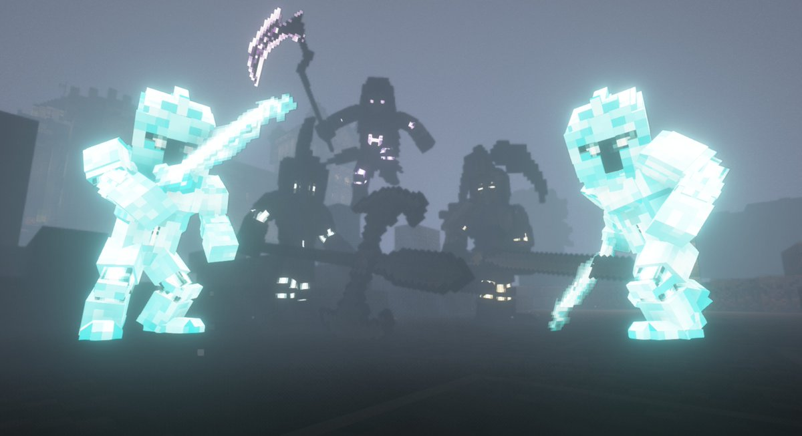
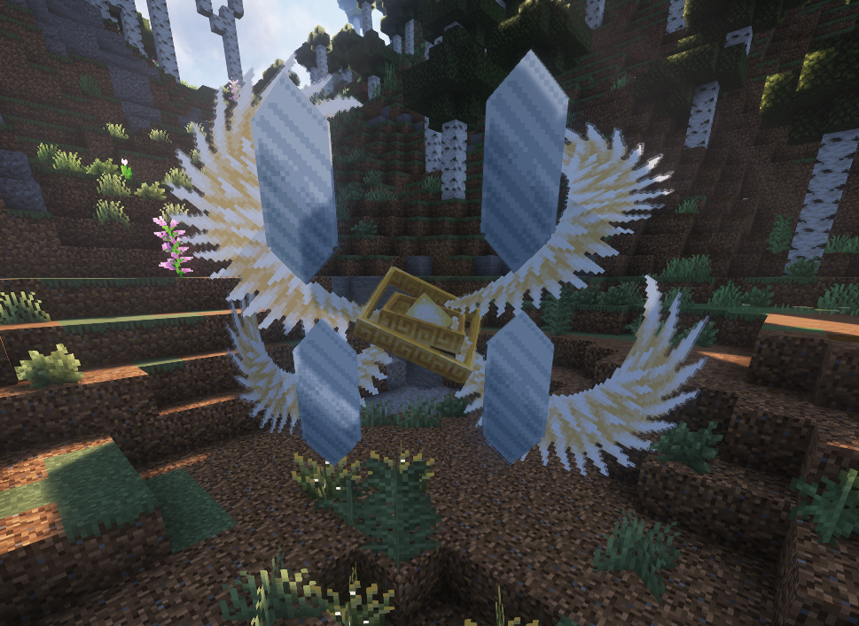
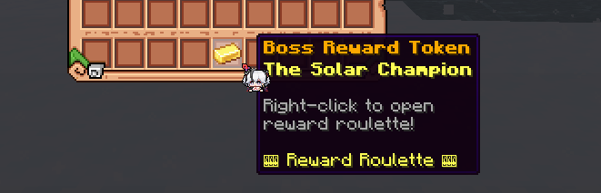
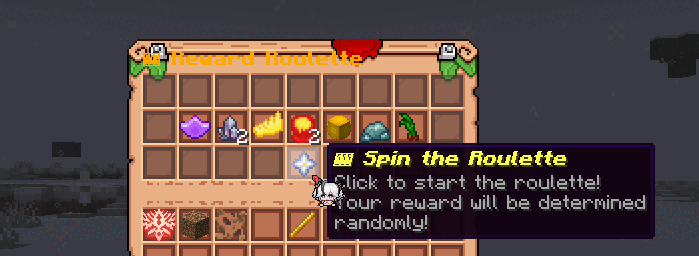
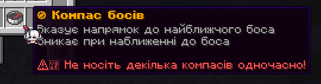

### Хто такі охоронці?

Охоронець (або "бос") — це потужний ворог, якого можна зустріти у відкритому світі. Кожен з них з'являється з інтервалом у **6 годин** у випадковому місці, про що повідомляється в чаті. Ви отримаєте відповідні повідомлення в чаті за 30, 15, 5 і 1 хвилину до їх появи.

### Для чого вони потрібні?

Якщо ви переможете цього потужного Охоронця, перш ніж він зникне сам по собі, ви отримаєте спеціальний предмет **"Жетон нагороди"**, який виглядає так:

Клацніть правою кнопкою миші, оберніть колесо і виграйте безцінні нагороди, унікальні для цього охоронця! Ви можете отримати магічні інгредієнти, рецепти і навіть характеристики!

### Важливі речі, на які слід звернути увагу

- Складність бою зростає з кількістю гравців, що беруть участь
- Токени винагороди можна передати іншим гравцям або використати пізніше
- Боси мають різний графік у вихідні та будні дні
- Ви можете використовувати "Компас босів", щоб шукати босів

P.S. Компас босів можна придбати тільки в магазині
