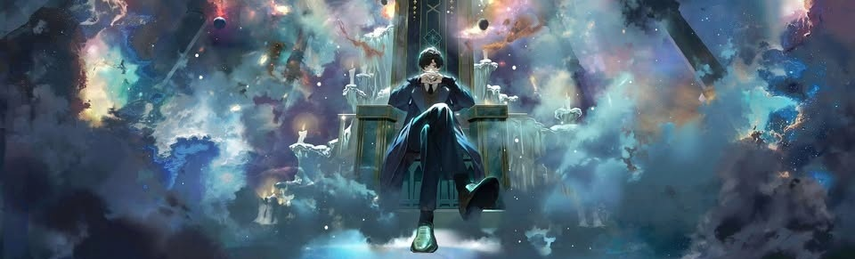

### Що таке Космічні вторгнення?

**Космічні вторгнення** — це великі динамічні події та постійні зміни навколишнього середовища, розроблені для того, щоб змінити баланс сил на сервері. Я наполегливо працював над створенням системи, де нагороди є гідними, але такими ж є і ризики!

Ці зони — це, по суті, місця, де тканина реальності слабшає, дозволяючи впливу Космосу просочуватися всередину.

---

### ⚔️ Вторгнення починається

Коли кількість одночасних гравців на сервері перевищує певний поріг (**30 гравців**), починається Вторгнення.

- **Масштабність:** Зони вторгнення відкриваються у випадкових місцях з радіусом 300-500 блоків.
- **Видимість:** Активні зони відображаються на онлайн-карті як великі напівпрозорі накладення.
- **Безпечний режим вимкнено:** При вході в Зону Вторгнення Безпечний режим автоматично вимикається. Ви не можете увімкнути його знову, перебуваючи всередині радіуса.

#### Місто проти Міста
Зона вторгнення часто зосереджена навколо точки захоплення. Це командна робота!
- **Мета:** Захопити та утримувати центральну точку якомога довше.
- **Нагорода:** Якщо ваше місто контролює точку на момент закриття події, все місто отримує потужний бафф: **Збільшення швидкості Відігравання + отримання Духовності** на 4 години.

---

### 🌈 Чи всі вони небезпечні?

Ну, це залежить від кольору зони.

Не всі вторгнення однаково суворі. Ми розділили їх на різні рівні складності, щоб ви знали, на що йдете:

| Колір зони | Штраф за смерть |
|---|---|
| **Зелена** | Ви втрачаєте лише один або два предмети. |
| **Жовта** | Ви втрачаєте більше предметів після смерті. |
| **Червона** | Ви втрачаєте всі предмети. |
| **Чорна** | **Високі ставки:** Ви можете втратити Послідовність або 50% прогресу відігравання. |

---

### 🗺️ Постійні зони

На відміну від тимчасових вторгнень, деякі регіони — часто цілі континенти — зазнають постійного впливу.

Всередині них PvP **дозволено завжди**. Замість простого бою ви знайдете Точки інтересу (POI), де можна збирати ресурси. Однак ви не можете просто втекти з ними; вам потрібно дістатися до **точки екстракції** і залишатися там достатньо довго, щоб успішно вилучити свою здобич. Ці ресурси потім можна обміняти на дуже цінні нагороди.

---

### 💀 Ставки високі

Це найважливіша механіка. Якщо ви — Потойбічний Послідовності нижче 7-ї і вас вбиває інший гравець у зоні високого ризику:
- Ви **втрачаєте одну Послідовність** (наприклад, Сонце 4-ї Послідовності деградує до 5-ї).
- Ви втрачаєте Характеристики Потойбічного, пов'язані з цією вищою послідовністю, які випадуть після вашої поразки.

#### 🪽 Паперовий Ангел
Щоб мінімізувати ризик втрати рівня, вам варто отримати **Паперового Ангела**.
- **Ефект:** Якщо ви зазнаєте поразки, тримаючи цей предмет, Ангел витрачається, але ви не втрачаєте Послідовність.
- **Як отримати:** Можна придбати в магазині або знайти як рідкісну здобич.

---

### 🔌 Захист від виходу під час бою

Втечі немає. Якщо ви від'єднаєтеся всередині Зони Вторгнення, на вашому місці з'явиться NPC-тіло. Якщо це тіло буде вбито, ви зазнаєте всіх стандартних наслідків, включаючи можливу втрату рівня.

---

### ⚖️ Обмеження для Напівбогів

Щоб ці зони були полем битви майстерності, а не місцем розправи над новими гравцями, я запровадив суворі **Правила залучення**:

1. **Захист від різниці рівнів**
   Якщо Потойбічний високого рівня вбиває гравця, який значно слабший (різниця у 2-3 рівні), вбивця **НЕ** отримує Скриню зі здобиччю, а жертва **НЕ** втрачає Послідовність.
   
2. **Мітка Тирана**
   Якщо Напівбог продовжує полювати на гравців, рівень яких значно нижчий (3+ вбивства «слабких» гравців), він отримує спеціальну мітку, видиму на онлайн-карті. **Мисливець сам стає здобиччю.**

3. **Нестабільність високих Послідовностей**
   Зони вторгнення нестабільні для могутніх істот. Якщо ваша Послідовність 4-та або 5-та, ви випромінюєте видимий **ефект світіння** (ніякої прихованості!) і отримуєте **0.5 HP шкоди** кожні кілька секунд.

---

### 💎 Ексклюзивна здобич

Навіщо ризикувати своєю послідовністю? Звісно, заради здобичі. Вбивство гравця в зоні нагороджує вас **PvP Скринею зі здобиччю**, що містить ексклюзивні предмети, які можна отримати лише всередині Зон Вторгнення.
