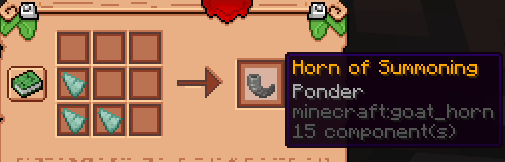

[//]: # (![Банер кур'єрів]&#40;../../../assets/couriers/couriers.jpg&#41;)

### Що таке кур'єри?

Кур'єри - це надприродні месники: Скелети, Медузи та Вогняні духи, які доставляють предмети безпосередньо до інших гравців. Викличте кур'єра **Рогом Виклику**, передайте йому посилку - і він сам подбає про решту.

---

### Як отримати Ріг Виклику

**Фрагменти Рогу Кур'єра** випадають зі скринь з лутом, розкиданих по Надземному світі. Зберіть **3 фрагменти** і скрафтіть з них Ріг Виклику на столі крафту, виклавши їх **Г-подібно**:

---

### Типи кур'єрів

Тип кур'єра, якого викликає ваш ріг, визначається **найвищим із ваших дозволів**. Якщо у вас є кілька - завжди буде вибрано найпотужнішого.

| Кур'єр | Місткість | Час доставки |
| :--- | :---: | :---: | 
| 🦴 **Скелет** | 1 предмет | 5 хв |
| 🪼 **Медуза** | 2 предмети | 5 хв |
| 🔥 **Вогненний** | 2 предмети | 3 хв |

> **Важливо:** Кур'єри не переносять стакнуті предмети. У кожен слот можна покласти лише один (нестакнутий) предмет.

---

### Як надіслати предмети

1. **Клікніть ПКМ** з Рогом Виклику в руці. Кур'єр з'явиться поруч із вами.
2. **Клікніть ЛКМ** по кур'єру, щоб відкрити його інтерфейс.
3. Покладіть потрібні **предмети** у слоти кур'єра (не більше дозволеної кількості).
4. Натисніть **«Обрати Одержувача»** і виберіть гравця, якому хочете відправити.
5. Натисніть **«Підтвердити Доставку»**, щоб відправити кур'єра.

Обидва гравці - відправник і одержувач - отримають сповіщення в чаті про початок і завершення доставки.

---

### Доставка офлайн-гравцям

Якщо одержувач **офлайн** під час відправлення - предмети стають у чергу. Кур'єр автоматично доставить їх наступного разу, коли гравець зайде на сервер, - після закінчення оригінального таймера доставки.

---

### Де працюють кур'єри

Кур'єрів можна викликати і вони здійснюють доставки в таких вимірах:

- Overworld
- Nether
- Manipulation Pool
- Mirror Realm
- Nightmare Pool
- Secret Lair

Спроба викликати кур'єра в будь-якому іншому вимірі (наприклад, у Краю) завершиться невдачею.

---

### Поради

1. **Відразу відкривайте інтерфейс** - клікніть ЛКМ по кур'єру одразу після виклику і завантажте предмети. Якщо відійдете, не завантаживши їх, кур'єр зникне.
2. **По одному предмету** - стакнуті предмети не приймаються. Розділіть стаки перед тим, як класти їх кур'єру.
3. **Будьте доступні** - якщо в момент доставки одержувач перебуває вище Y 320 або у непідтримуваному вимірі, кур'єр автоматично повторює спробу кожні 5 секунд.
