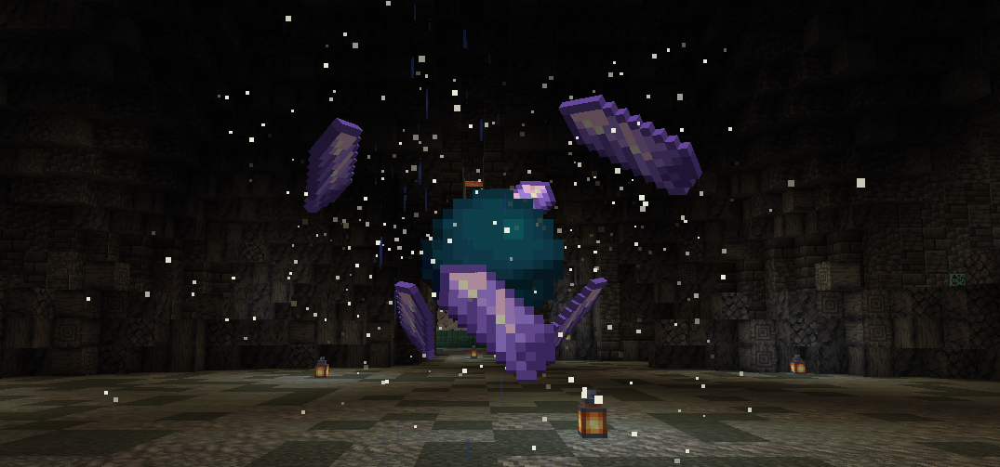

### Що таке підземелля?

Підземелля — це окремий вимір із власними правилами, мешканцями та викликами. Команда з декількох гравців заходить у нього, отримує необхідне спорядження і повинна просуватися вперед, поступово перемагаючи ворогів у кімнатах. У кінці на вашу команду чекає могутній бос, і перемога над ним дає вам право вийти переможцями з цього виміру та забрати всі зароблені нагороди.

Всередині ви можете отримати різні рецепти та магічні інгредієнти для шляхів. Ви також можете знайти рідкісні предмети Minecraft, такі як музичні диски, зачаровані золоті яблука та інше.

### Як увійти?

Щоб увійти, вам потрібно зібрати групу за допомогою команди `/party`

- **Підземелля Альфа** вимагає групи з чотирьох гравців (наразі нагороди від 9 до 7 послідовно)
- **Підземелля Бета** вимагає групи з п'яти гравців (наразі нагороди від 9 до 7 послідовно)
- **Підземелля Дельта** вимагає групи з чотирьох гравців (наразі нагороди від 5 до 6 послідовно)

Тільки лідер групи повинен подорожувати до входу в підземелля; решта групи може робити що завгодно, поки підземелля не почнеться. Підтвердьте вхід на запит, почекайте трохи, поки завантажиться створена для вас інстанція підземелля, виберіть спорядження класу — і ви готові до старту!

### Що таке розломи?

Щоб увійти в саме підземелля, вам потрібно знайти вхід до нього, який розташований десь у відкритому світі. Він виглядає як стовп з різнокольорових частинок, які збираються в цікавий візерунок, змінюють колір, мерехтять і піднімаються над центром. Це може виглядати так:

Кожна розлом може також мати прикріплений до неї знак із переліком можливих нагород, поточним станом, назвою та описом.

### Як активувати розлом?

Щоб активувати розлом і відкрити прохід через нього до відповідного **підземелля**, потрібно ослабити його:

1. Знайдіть його місце розташування у світі.
2. Підійдіть до нього, почекайте, поки він відкине вас назад.
3. Почекайте на повідомлення:

> Вузол занадто сильний. Ви можете спробувати ослабити його. [Спробувати?]

4. Натисніть **[Спробувати?]**.
5. Витримайте силу захисного механізму

Для ослаблення використовуються **Фрагменти енергії**. Прогрес ослаблення відображається на табличці, прикріпленій до нього і розташованій біля самого входу (її не видно через блоки).

### Нагороди та трофеї

Нагороди за проходження підземелля є **індивідуальними** — тобто той, хто першим дістанеться до трофеїв, отримує їх. Трофеї можна знайти в бочках і скринях:
- **Бочки** містять предмети, які допомагають просуватися підземеллям, такі як зілля та золоті яблука.
- **Скрині** містять нагороди, які можна забрати з підземелля після успішного проходження (перемоги над босом протягом 30 хвилин).

Ви можете отримати доступ до нагород підземелля за допомогою команди `/rewards`. Здобич залишається там до перезапуску **І БУДЕ ВТРАЧЕНА ПІСЛЯ**!