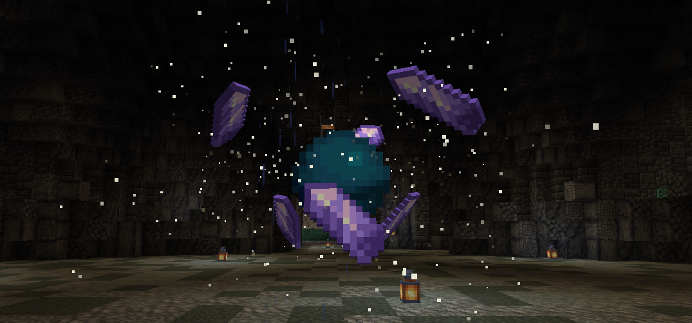
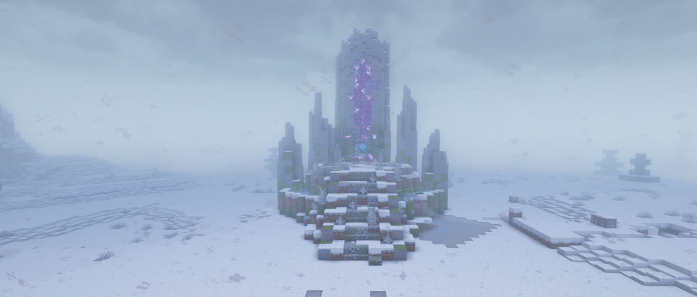

### Що таке Підземелля?

Підземелля (Dungeon) — це окремий вимір зі своїми правилами, мешканцями та викликами. Група з кількох гравців заходить у нього, отримує необхідне спорядження та повинна просуватися вперед, поступово перемагаючи ворогів у кімнатах. Наприкінці на вашу групу чекає потужний Бос, перемога над яким дає право вийти з цього виміру тріумфатором і забрати всі зароблені нагороди.

---

### Як туди потрапити?

Щоб увійти, вам потрібно зібрати групу за допомогою команди `/party`.

- **Alpha Dungeon** потребує групи з чотирьох гравців.
- **Beta Dungeon** потребує групи з п'яти гравців.
- **Delta Dungeon** потребує групи з чотирьох гравців.

Тільки лідеру групи потрібно прибути до входу в підземелля; решта учасників можуть займатися своїми справами до початку. Підтвердьте вхід за запитом, зачекайте трохи, поки завантажиться згенерований екземпляр (instance) підземелля, оберіть спорядження свого класу — і ви готові до бою!

---

### Що таке Розломи?

Щоб потрапити в саме підземелля, вам потрібно знайти вхід у відкритому світі. Він виглядає як стовп різнокольорових частинок, які збираються в цікавий візерунок, змінюють колір, мерехтять і піднімаються над центром. Це може виглядати так:

До кожного Розлому (Rift) також може бути прикріплена табличка зі списком можливих нагород, поточним станом, назвою та описом.

---

### Як активувати Розлом?

Щоб активувати Розлом і відкрити прохід до відповідного **Підземелля**, вам потрібно послабити його:

1. Знайдіть його розташування у світі.
2. Підійдіть близько і зачекайте, поки він вас відштовхне.
3. Дочекайтеся повідомлення:

> Вузол занадто сильний. Ви можете спробувати послабити його. [Спробувати?] (The Node is too strong. You can try to weaken it. [Try?])

4. Натисніть на **[Спробувати?]**.
5. Витримайте міць захисного механізму.

Для послаблення використовуються **Енергетичні осколки (Energy Shards)**. Прогрес послаблення відображається на табличці, прикріпленій до розлому. Зауважте, що послаблення Розлому вимагає **участі всього сервера** — це спільне зусилля спільноти.

---

### Скільки разів можна проходити Підземелля?

Кожне підземелля можна проходити **до 3 разів на день**. Цей ліміт скидається щодня.

:::tip[Більше немає тижневого блокування]
Підземелля більше не обмежені одним разом на тиждень — ви можете проходити їх кілька разів на день і накопичувати нагороди!
:::

---

### Нагороди та Картки Допомоги (Help Cards)

На відміну від того, що було раніше, проходження підземелля понад ваш ліміт раз на тиждень — **не дає прямого луту**. Але ви все одно можете грати в нього, і натомість ви отримуєте **Картки Допомоги (Help Cards)** — спеціальну валюту підземелля, яку згодом можна обміняти на цінні нагороди.

Картки Допомоги специфічні як для **підземелля**, так і для **складності**, яку ви пройшли:

| Складність | Тип Картки Допомоги | Цінність обміну |
|------------|---------------|----------------|
| Звичайна (Normal) | Normal Help Card | Стандартні нагороди |
| Покращена (Advanced) | Advanced Help Card | Кращі нагороди |
| Майстер (Master) | Master Help Card | Високоцінні ресурси |

Наприклад, накопичені **25 Master Help Cards** можна обміняти на дуже цінні ресурси. Зберігайте їх і обирайте обмін мудро!

---

### Складність Підземель

Підземелля тепер мають три рівні складності, які відкриваються **поступово**, у міру того, як ви та ваша група стаєте сильнішими:

- **Звичайна (Normal)** — доступна з самого початку. Стандартний виклик.
- **Покращена (Advanced)** — відкривається, коли ваша група стає сильнішою. Важчі вороги, кращі Картки Допомоги.
- **Майстер (Master)** — найвищий рівень складності. Потребує значної сили. Нагороди суттєво кращі.

Вищі рівні складності складніші, але специфічні для складності Картки Допомоги, які ви заробляєте, варті зусиль.

---

### Класи Підземель

При вході в підземелля кожен гравець обирає **клас**, який визначає його роль під час проходження. Класи були суттєво перебалансовані:

| Клас | Сильні сторони | Обмеження |
|-------|-----------|--------------|
| **Танк** | Високий захист, витривалість | **Не може використовувати магічні заклинання** |
| **Маг** | Збільшена магічна шкода | **Не може завдавати фізичної шкоди** |
| Інші класи | Варіюється | Варіюється |

Обирайте свій клас ретельно, виходячи зі складу вашої групи!
