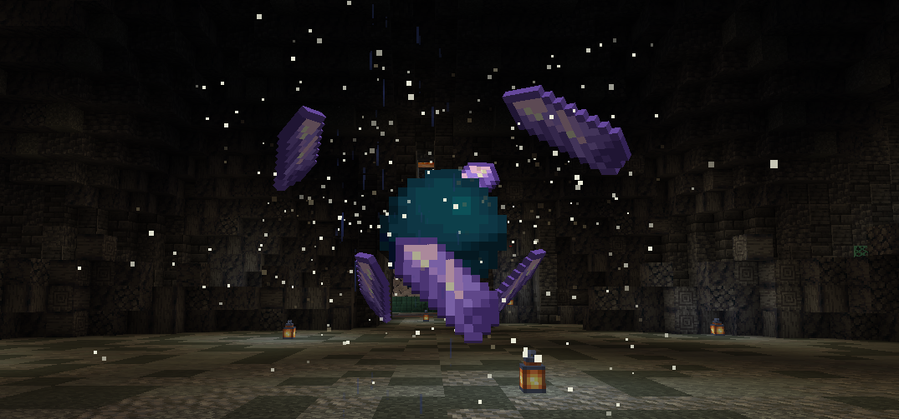
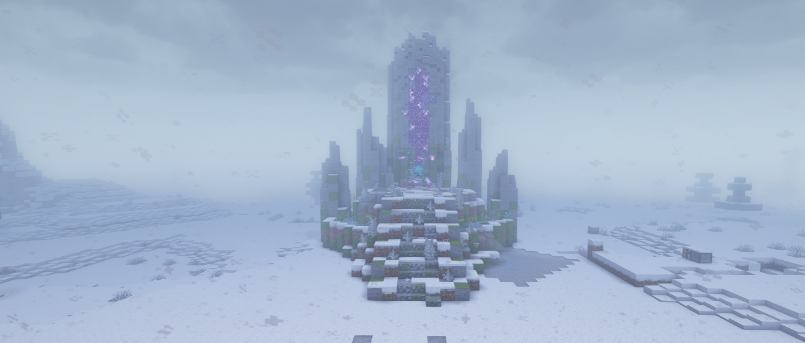

### Що таке Підземелля?

Підземелля - це окремий вимір зі своїми правилами, мешканцями та викликами. Група з кількох гравців заходить у нього, отримує необхідне спорядження та повинна просуватися вперед, поступово перемагаючи ворогів у кімнатах. Наприкінці на вашу групу чекає потужний Бос, перемога над яким дає право вийти з цього виміру тріумфатором і забрати всі зароблені нагороди.

---

### Як знайти підземелля?

Скористайтеся командою `/subspace`. Вона відкриває меню зі списком **усіх підземель у грі**, і для кожного показує:

- **Де знаходиться вхід** - координати його Розлому.
- **Як ваша сила співвідноситься** з рівнем, на який розраховане підземелля.
- **Ваші поточні перезарядки** для цього підземелля.

Команда повністю безкоштовна і не має власної перезарядки. Заглядайте туди щоразу, коли не знаєте, що проходити далі.

---

### Як туди потрапити?

Щоб увійти, вам потрібно зібрати групу за допомогою команди `/party`.

- **Alpha Dungeon** потребує групи з чотирьох гравців.
- **Beta Dungeon** потребує групи з п'яти гравців.
- **Delta Dungeon** потребує групи з чотирьох гравців.

Тільки лідеру групи потрібно прибути до входу в підземелля; решта учасників можуть займатися своїми справами до початку. Підтвердьте вхід за запитом, зачекайте трохи, поки завантажиться згенерований екземпляр підземелля, оберіть спорядження свого класу - і ви готові до бою!

---

### Чи можна зайти меншою кількістю гравців?

Так. Підземелля можна проходити **неповним складом** - з меншою кількістю гравців, ніж стандартний розмір групи - за однієї умови: **сила вашої групи має бути на рівні або нижче рівня, на який розраховане підземелля.**

- Якщо ви **сильніші** за підземелля, прохід неповним складом буде заблоковано. Не можна привести малу групу високопослідовних Потойбічних, щоб легко фармити контент, призначений для більших і слабших груп.
- **Нагороди не зменшуються** при проходженні неповним складом. Менша група отримує рівно той самий лут - просто пройти підземелля вдвох чи втрьох об'єктивно важче.

:::tip[Навіщо це потрібно]
Коли більшість активних гравців сервера проходить далі за низькорівневе підземелля, не залишається нікого, щоб зібрати повну групу для нього. Прохід неповним складом зберігає цей контент доступним для новачків, для яких він і створювався.
:::

---

### Що таке Розломи?

Щоб потрапити в саме підземелля, вам потрібно знайти вхід у відкритому світі. Він виглядає як стовп різнокольорових частинок, які збираються в цікавий візерунок, змінюють колір, мерехтять і піднімаються над центром. Це може виглядати так:

До кожного Розлому також може бути прикріплена табличка зі списком можливих нагород, поточним станом, назвою та описом.

---

### Як активувати Розлом?

Щоб активувати Розлом і відкрити прохід до відповідного **Підземелля**, вам потрібно послабити його:

1. Знайдіть його розташування у світі.
2. Підійдіть близько і зачекайте, поки він вас відштовхне.
3. Дочекайтеся повідомлення:

> Вузол занадто сильний. Ви можете спробувати послабити його. [Спробувати?]

4. Натисніть на **[Спробувати?]**.
5. Витримайте міць захисного механізму.

Для послаблення використовуються **Енергетичні осколки**. Прогрес послаблення відображається на табличці, прикріпленій до розлому. Зауважте, що послаблення Розлому вимагає **участі всього сервера** - це спільне зусилля спільноти.

---

### Скільки разів можна проходити Підземелля?

Існує два різні типи проходження з окремими лімітами:

| Тип проходження | Як часто | Що ви отримуєте |
|-----------------|----------|-----------------|
| **Прохід за нагороду** | **Раз на 3 дні**, для кожного підземелля | Повний лут |
| **Прохід за картки** | **2 рази на день** | Без луту - лише **Картки Допомоги** |

Свої поточні перезарядки для кожного підземелля завжди можна переглянути через `/subspace`.

:::tip[Як обійти перезарядку]
**Ключі від Підземель**, доступні в Магазині, дозволяють обійти 3-денну перезарядку та одразу пройти підземелля за повний лут ще раз.
:::

---

### Нагороди та Картки Допомоги

Проходи за картки **не дають прямого луту**. Натомість ви отримуєте **Картки Допомоги** - спеціальну валюту підземелля, яку згодом можна обміняти на цінні нагороди, зокрема на **Пляшечки Втілення**.

Картки Допомоги специфічні як для **підземелля**, так і для **складності**, яку ви пройшли:

| Складність | Тип Картки Допомоги | Цінність обміну |
|------------|---------------|----------------|
| Звичайна | Звичайна картка допомоги | Стандартні нагороди |
| Покращена | Покращена картка допомоги | Кращі нагороди |
| Майстер | Мастер-картка допомоги | Високоцінні ресурси |

Наприклад, накопичені **25 Мастер-карток допомоги** можна обміняти на дуже цінні ресурси. Зберігайте їх і обирайте обмін мудро!

---

### Складність Підземель

Підземелля тепер мають три рівні складності, які відкриваються **поступово**, у міру того, як ви та ваша група стаєте сильнішими:

- **Звичайна** - доступна з самого початку. Стандартний виклик.
- **Покращена** - відкривається, коли ваша група стає сильнішою. Важчі вороги, кращі Картки Допомоги.
- **Майстер** - найвищий рівень складності. Потребує значної сили. Нагороди суттєво кращі.

Вищі рівні складності складніші, але специфічні для складності Картки Допомоги, які ви заробляєте, варті зусиль.

---

### Класи Підземель

При вході в підземелля кожен гравець обирає **клас**, який визначає його роль під час проходження. Класи були суттєво перебалансовані:

| Клас | Сильні сторони | Обмеження |
|-------|-----------|--------------|
| **Танк** | Високий захист, витривалість | **Не може використовувати магічні заклинання** |
| **Маг** | Збільшена магічна шкода | **Не може завдавати фізичної шкоди** |
| Інші класи | Варіюється | Варіюється |

Обирайте свій клас ретельно, виходячи зі складу вашої групи!
