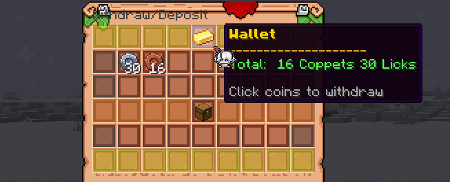
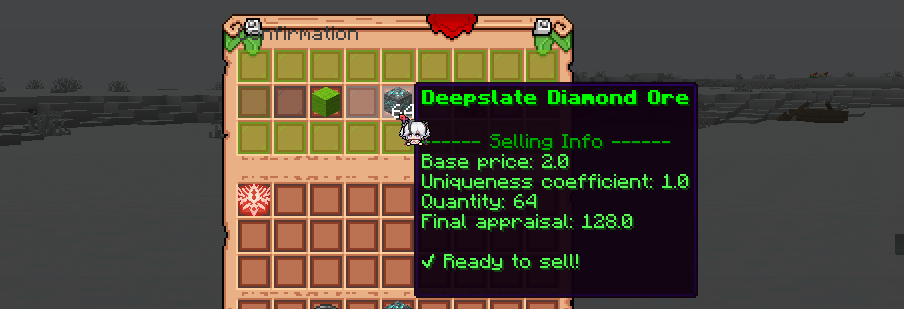

### Чому не алмази?

Ми хочемо, щоб економіка сервера була цікавою та відповідала сетингу LoTM (Lord of the Mysteries). Використання стандартних валют Minecraft може зробити економіку менш захоплюючою та менш інтегрованою в ігровий процес.

Крім того, стандартні предмети мають дуже сильну тенденцію до інфляції, що може негативно вплинути на баланс економіки. Через місяць-два вона може стати нестабільною, з дуже низькими цінами на все і неможливістю придбати справді важливі речі (наприклад, елітри або деякі магічні інгредієнти, які є ключовими для розвитку персонажа).

### Які валюти є на сервері?

На сервері є три основні валюти:
- Коппет (Coppet) — базова валюта для дрібних покупок.
- Лік (Lick) — середня валюта для більш значущих покупок.
- Верльдор (Verl d'or) — найдорожча валюта для особливих предметів.

**Назви валют були взяті з новели «Lord of the Mysteries», зокрема з економічної системи Республіки Інтіс.**

### Що таке гаманець?

Гаманець (Wallet) — це спеціальний предмет, який дозволяє зберігати всі три валюти в одному місці. Це зручно для гравців, оскільки вони можуть легко керувати своїми фінансами без необхідності носити окремі предмети для кожної валюти.

#### ✨ Можливості гаманця:

- Зберігання всіх валют.
- Конвертація ресурсів у валюту.
- Купівля предметів та участь у торгівлі.

P.S. Починаючи з певного оновлення, ви можете просто використовувати команду `/wallet`.

### Для чого ще потрібен гаманець?

Насправді гаманець виконує ще більше функцій:
- Використовується для торгівлі з селянами.
- Зберігає кошти та дозволяє отримувати валюту за виконання завдань та участь у подіях.
- Надає можливість конвертувати ресурси у валюту.
- Використовується для оплати послуг, що потребують $.

> Щоб підвищити рівень міста, вам потрібно $300. Що це таке, де це взяти? Насправді все дуже просто — ціна вказана в Коппетах. Щоб мати можливість здійснити оплату, вам потрібно мати гаманець із принаймні 300 Коппетами всередині.

### Як я можу заробити гроші?

Основним способом заробітку валюти (крім торгівлі з іншими гравцями, звісно) є оцінка предметів.

Ви можете продавати ресурси через механіку оцінки:
1. Перемістіть предмет у гаманець.
2. Отримайте оцінку в Коппетах.
3. Підтвердьте продаж або скасуйте його.

**P.S. Ви можете продавати лише невідновлювані руди, видобуті киркою з «Шовковим дотиком» (Silk Touch), і не всі! Якщо у вашому інвентарі є предмети, які можна продати, вони автоматично з'являться в нижньому вікні гаманця.**

**P.S.S.** Ви також можете отримати гроші з Бойової перепустки (Battlepass)!
