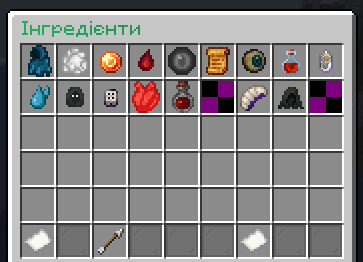
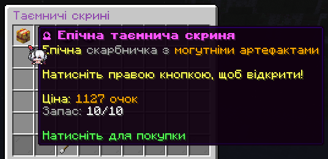

### Що таке Brilliant Emporium?

**Brilliant Emporium** — це нова механіка, доступна для всіх гравців на сервері. Це спеціальний магазин, де можна придбати унікальні предмети, яких немає в звичайних магазинах, переважно магічні зілля.

Emporium доступний за допомогою команди `/emporium` або її псевдоніма `/emp`. Отримати його очки можна тільки **голосуючи за сервер**, підтримуючи **щоденну серію входів** і **повідомляючи про помилки**.  Його стандартний вигляд такий:

### Що можна там придбати?

Емпоріум поділений на п'ять категорій:

- Інгредієнти
- Таємничі скриньки
- Зачарування
- Магічні рецепти
- Зілля

Кожна категорія містить низку предметів, які щодня змінюються з загального пулу. Кінцева ціна також змінюється щодня, але базова ціна залишається незмінною для всіх предметів в одній категорії.

Кількість кожного товару обмежена, тому хто перший прийшов, той і отримав!

### Що таке таємничі скриньки?

Якщо ви хочете спробувати свою удачу, ви можете придбати таємничу скриньку у відповідній категорії. Відкрийте її, тримаючи в руці та клацнувши правою кнопкою миші. Загальний набір нагород залежить від рівня скриньки, але самі нагороди можуть бути будь-якими!

