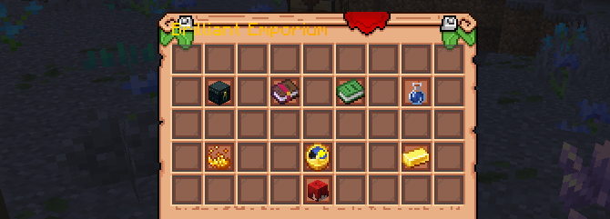
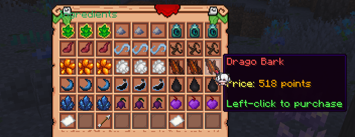
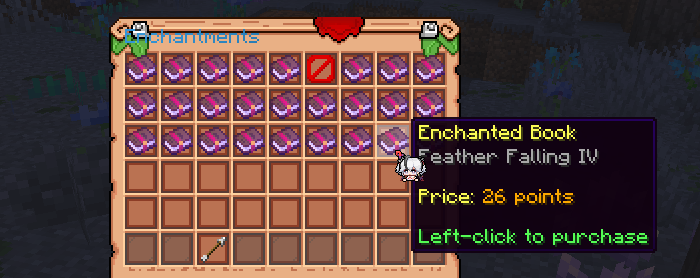
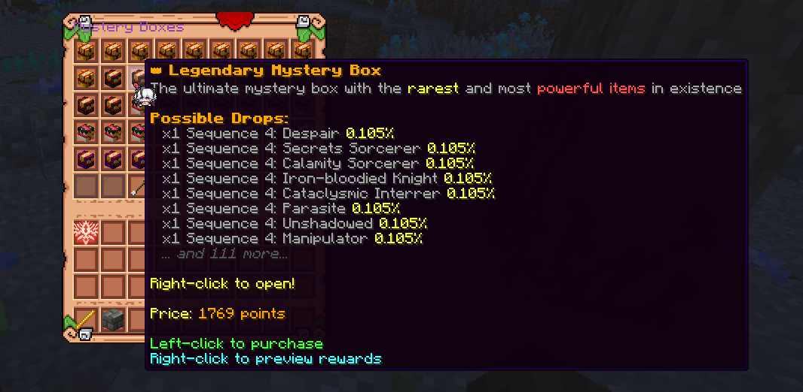

### Що таке Блискучий Емпоріум?

**Діамантовий Емпоріум (Brilliant Emporium)** — це нова механіка, доступна для кожного гравця на сервері. Це спеціальний магазин, де ви можете придбати унікальні предмети, недоступні у звичайних крамницях, в основному призначені для магічних зілля.

Емпоріум доступний за командою `/emporium` або її псевдонімом `/emp`. Ви можете отримати очки для покупок лише шляхом **голосування за сервер**, підтримання **щоденної серії входів** та **повідомлень про баги**. Його стан за замовчуванням виглядає так:

### Що там можна купити?

Емпоріум розділений на п'ять категорій:

- Інгредієнти
- Таємничі скриньки
- Зачарування
- Магічні рецепти
- Зілля

Кожна категорія містить певну кількість предметів, які щодня змінюються із загального пулу. Кінцева ціна також змінюється щодня, але базова ціна залишається однаковою для всіх товарів в одній категорії.

Ліміт продажу для кожного продукту обмежений: хто першим прийшов, того першим і обслуговують!

### Що таке таємничі скриньки?

Якщо ви хочете випробувати свою удачу, ви можете спробувати придбати таємничу коробку у відповідній категорії. Відкрийте її, тримаючи в руці та натиснувши ПКМ. Загальний набір нагород залежить від рівня коробки, але самими нагородами може бути що завгодно!

