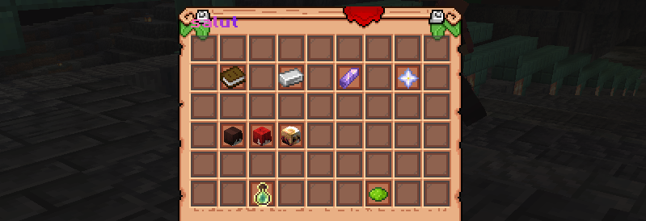

### Що таке таємні ордени?

Таємні організації — це нова механіка на нашому сервері. Вона дозволяє кільком гравцям створити власний **орден**, поширюючи його вплив по всьому світу.

Таємні організації — це функція, доступна тільки за допомогою пожертв, яка залишається активною, поки активна підписка лідера, і надає все більші переваги в міру розвитку організації, покращуючи зручність взаємодії та прогрес гравців.

### Система рівнів і бонусів

### Рівень 0 — "Шепіт туману"

Перший рівень, доступний після отримання спонсорської підтримки, і єдиний, який може бути активним після закінчення спонсорської підтримки.

> - До трьох членів

> - Команди: `/o invite`, `/o kick`, `/o vice set/remove`

> - Захист від магічного ушкодження між членами

> - Приватний чат `/oc`; Формат повідомлення: [Назва організації] Нік > повідомлення

### Рівень 1 — "Тінь туману"

> - До чотирьох членів

> - **Віддалений обмін:** можна передавати предмети між членами організації за вартість виконання (0,25% – 0,5% за слот)

> - **Сигнал SOS:** `/o sos` — координати користувача відображаються в чаті організації

### Рівень 2 — "Погляд туману"

> - До п'яти членів

> - **Кишеньковий вимір:** доступ до спільного приміщення для зустрічей організації

### Рівень 3 — "Обійми туману"

> - До шести членів

> - **Миттєве виклик:** миттєво викликати членів організації до себе

> - **Ритуал зростання:** підвищити ефективність дій членів організації на 24 години

> - **Ритуал об'єднання:** об'єднати духовність членів організації на 10 хвилин

### Рівень 4 — "Серце туману"

> - До семи членів

> - **Таємна схованка**: телепортація до постійної таємної бази організації

## Підвищення рівня

Підвищення рівня відбувається за допомогою **енергетичних осколків**, які можна отримати, продаючи магічні інгредієнти. Кожна організація матиме спільну скарбницю, до якої кожен член може робити внески, щоб разом досягти наступного рівня.

