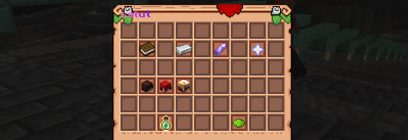
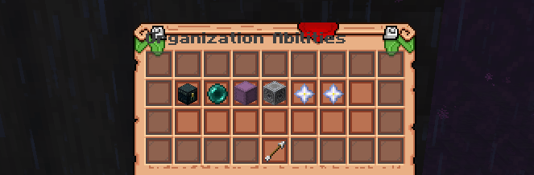
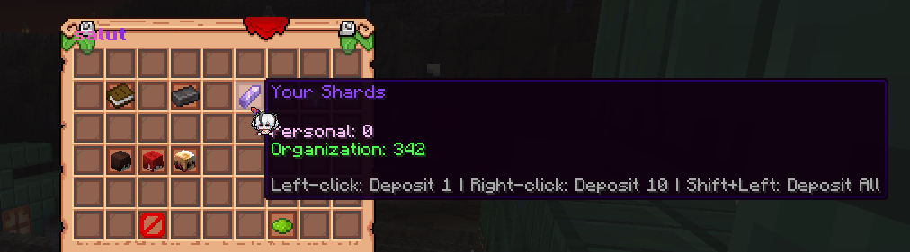

### Що таке Таємні Ордени?

Таємні організації — це нова механіка на нашому сервері. Вона дозволяє кільком гравцям створити власний **Орден**, поширюючи його вплив по всьому світу.

Таємні організації — це функція, доступна лише за пожертвування (донат), яка залишається активною доти, доки активна підписка лідера, і надає все більше переваг у міру розвитку організації, покращуючи зручність взаємодії та прогрес гравців.

### Система рівнів та бонусів

### Рівень 0 — «Шепіт Туману»

Перший рівень, доступний при отриманні спонсорства, і єдиний, який може залишатися активним після закінчення терміну спонсорства.

> - До трьох учасників.

> - Команди: `/o invite`, `/o kick`, `/o vice set/remove`.

> - Захист від магічної шкоди між учасниками.

> - Приватний чат `/oc`; Формат повідомлення: [Назва організації] Нік > повідомлення.

### Рівень 1 — «Тінь Туману»

> - До чотирьох учасників.

> - **Дистанційний обмін:** можливість передавати предмети між членами організації за ціну виконання (0.25% – 0.5% за слот).

> - **Сигнал SOS:** `/o sos` — координати користувача відображаються в чаті організації.

### Рівень 2 — «Погляд Туману»

> - До п'яти учасників.

> - **Кишеньковий вимір:** доступ до спільного простору для зустрічей організації.

### Рівень 3 — «Обійми Туману»

> - До шести учасників.

> - **Миттєвий заклик:** миттєво закликайте членів організації до себе.

> - **Ритуал зростання:** посилення отримання очок Відігравання для членів організації на 24 години.

> - **Ритуал об'єднання:** об'єднання Духовності між членами організації на 10 хвилин.

### Рівень 4 — «Серце Туману»

> - До семи учасників.

> - **Таємне лігво**: телепортація до постійної таємної бази організації.

## Підвищення рівня

Підвищення рівня відбувається за допомогою **Енергетичних осколків**, які можна отримати, продаючи магічні інгредієнти. Кожна організація матиме спільну скарбницю, куди кожен учасник може зробити внесок, щоб разом досягти наступного рівня.

