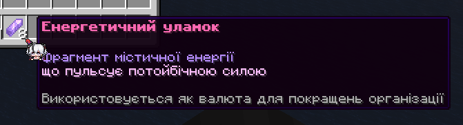
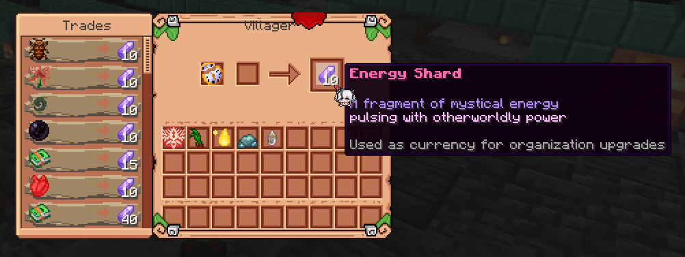

### Що таке Енергетичні осколки?

Енергетичні осколки — це нова валюта, яка виглядає так ^

### Для чого вони потрібні?

Ця нова валюта потрібна для багатьох речей, таких як:
- Підвищення рівнів таємних організацій.
- Послаблення входів до підземель (розломів).
- Оплата послуг караванів Шовкового шляху.
- Сезонні події з обмеженим часом тощо.

### Як їх отримати?

Для цього нам потрібні селяни без професії (нітвіти/дурні), які раніше не мали жодної мети. Переконайтеся, що у вас є такий, і натисніть на нього ПКМ, що відкриє наступне меню:

### Що там можна продати?

Кожен із них може купити у вас деякі речі в обмін на Енергетичний осколок:

- Магічні інгредієнти всіх Послідовностей.
- Магічні рецепти всіх Послідовностей.

Це гарний спосіб обміняти залишки інгредієнтів і рецептів на щось корисніше! Особливо, коли триває подія з обмеженим часом або коли ви хочете використати їх для оплати інших послуг.
