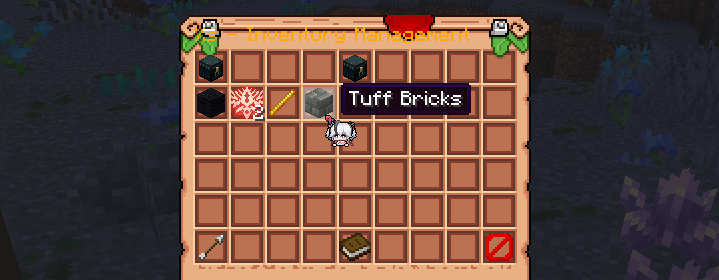
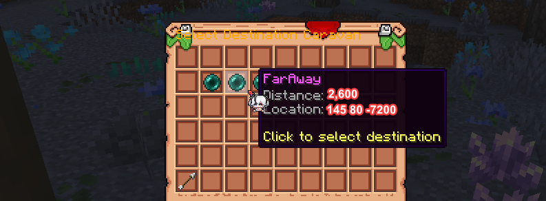

### Що таке Шовковий шлях?

Шовковий шлях — це механізм, який дозволяє гравцям створювати торгові маршрути між великими містами, використовуючи каравани для подолання великих
відстаней, не витрачаючи час на подорожі або будівництво підземних автомагістралей. Ось як це працює:

### Як створити караванний пост

Гравці повинні побудувати спеціальний пост на території поблизу свого міста.

- Пост повинен знаходитися на території дійсного міста рівня не нижче **2**
- Пост повинен бути відповідним чином оформлений і відповідати візуальним вимогам
- Пост повинен відповідати тематиці міста і загалом мати приємний вигляд

Адміністратори перетворять їх на офіційні караванні пости за запитом.

### Відправлення каравану

1. Мешканці відкривають інтерфейс в офіційному пості за допомогою команди `/caravan`
2. Покладіть предмети, які ви хочете відправити в інше місто, у відповідне меню

   
3. Виберіть місто призначення зі списку великих міст, де є поштові відділення

   
4. Сплатіть необхідну суму **енергетичних осколків**, щоб підтвердити доставку
5. Готово. Інша пошта отримає вашу посилку через деякий час!

### Отримання товарів

- Після встановленого часу подорожі караван прибуває до поштової станції призначення
- Члени міста призначення можуть забрати їх зі своєї поштової станції без комісії

Ця система заохочує торгівлю, співпрацю та стратегічне планування між містами.  І більше не потрібно копати камінь, рити кілометрові гілки метро тільки для того, щоб торгувати!