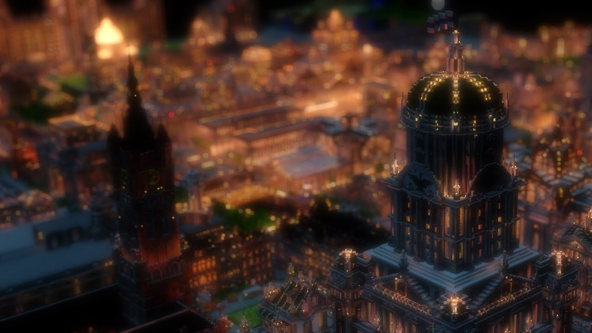

### Що таке Бонуси Міста?

Бонуси Міста — це унікальні, спеціально розроблені баффи, які надаються містам, що завершили масштабні архітектурні проекти. На відміну від стандартних функцій міста, ці бонуси вручну оцінюються та застосовуються адміністраторами, щоб нагородити креативність, масштабність та активне розбудову спільноти.

### Як це працює

1.  **Будуйте** — створіть вражаючу споруду (наприклад, Собор, Велику Бібліотеку).
2.  **Подайте заявку** — відкрийте тікет підтримки в Discord, надавши координати та скріншоти.
3.  **Оцінка** — адміністратори оцінюють якість побудови, рівень міста та кількість населення.
4.  **Активація** — у разі схвалення, на вашу територію буде застосовано спеціальний бафф на область.

---

### Рівні бонусів та вимоги

Не всі бонуси доступні кожному місту. Чим розвиненіше ваше поселення, тим сильнішим стає «духовний» та «фізичний» резонанс ваших споруд.

| Іконка | Назва бонусу | Мін. рівень | Мін. гравців | Архітектурна вимога |
| :--- | :--- | :---: |:------------:| :--- |
| 🌾 | **Сільське господарство** | **Рів. 2** |      5       | Спеціальна оранжерея або функціональна клуня. |
| 🛡️ | **Захист від мобів** | **Рів. 4** |      12      | Завершені оборонні стіни або центральна сторожова вежа. |
| 🧪 | **Ефекти зілля** | **Рів. 5** |      18      | Алхімічна лабораторія або броварня з деталізованим інтер'єром. |
| ✨ | **Бонус досвіду** | **Рів. 6** |      22      | Бібліотека або академія, що містить щонайменше 200 книжкових полиць. |
| 🛠️ | **Ремонт броні** | **Рів. 8** |      30      | Масштабна кузня або промисловий район із «механізмами». |
| 🎭 | **Бонус відігравання** | **Рів. 10** |      40      | Гранд-театр або Арена. Потребує 3+ Напівбогів. |
| 🌀 | **Духовність** | **Рів. 10** |      45      | Собор або Храм Шляху. Потребує 5+ Напівбогів. |

---

### Доступні типи бафів

> **🛡️ Захист від мобів** — запобігає появі ворожих мобів у межах визначеної зони.

> **🧪 Ефекти зілля** — надає постійні ефекти, такі як Швидкість, Поспіх або Нічний зір.

> **🌾 Покращене сільське господарство** — значно збільшує швидкість росту врожаю.

> **🛠️ Відновлення броні** — поступово відновлює міцність одягненої броні з часом.

> **✨ Бонус досвіду** — примножує кількість отриманого досвіду, поки ви перебуваєте в межах міста.

> **🎭 Посилення відігравання** — збільшує кількість очок відігравання, отриманих за використання здібностей.

> **🌀 Духовна регенерація** — радикально збільшує швидкість відновлення Духовності.

### Налаштування території

Залежно від споруди, баффи можуть застосовуватися в різних формах:
- **Радіус**: кругла зона навколо центрального монумента.
- **Прямокутник**: покриває конкретно міську площу або ратушу.
- **Глобально**: охоплює всю заявлену територію (лише для міст 10-го рівня).

---

### Поради для схвалення

1. **Тематична відповідність** — гігантський дракон має надавати захист або бонуси до шкоди, тоді як собор — духовність або зцілення.

2. **Масштаб має значення** — маленькі будинки не підійдуть. Ми шукаємо проекти стилю «Диво світу», які визначають ландшафт сервера.

3. **Завершеність** — не подавайте незавершені будівлі або «оболонки» без інтер'єрів. Якість перевіряється як зовні, так і всередині!
