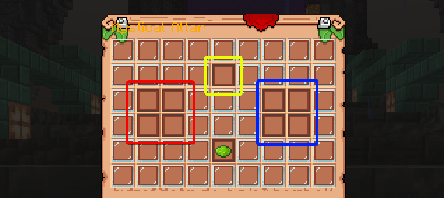

---

### Who is a Beyonder?

A **Beyonder** is a player who has drunk a magical potion and gained extraordinary abilities. Want to become one of them? Then you'll need a **Magic Altar** and the right ingredients!

---

### What is Magic Altar?

To brew magical potions, you need to create a **Magical Cauldron**. This is a special structure that you must **build yourself**. Once it is assembled, you will be able to interact with the cauldron!

:::tip[Update]
The **Beyonder Cauldron** consists of **several blocks** and has a **new design**. The blueprint for its construction can be found by exploring the world. Press **LMB** on the found blueprint to place the structure and follow the instructions in the chat!
:::

---

### What are Beyonder Ingredients?

To create a magical potion, you will need **main** and **supplementary** Beyonder ingredients. Usually, these are **Beyonder items** that can be found or obtained by meeting certain conditions

Which ones exactly? You'll have to find that out **on your own!** Different items come from different sources!

### What are Beyonder characteristics?

Sometimes in the world, you may come across **Beyonder Characteristics** — items that look like colored orbs / player heads. They can **replace** one of the main ingredients in a recipe. They also have other uses at higher sequences

For example, if a potion requires **3 different ingredients**, you can use **3 characteristics**, completely replacing them!

---

### What are Beyonder recipes?

To brew a potion, you need to know the correct combination of ingredients.

**Where to find recipes?**

In the open world, you can find **recipes** — ancient **books** with a complete list of the necessary ingredients. They are usually found in **chests** that can be discovered during your travels!

---

### What are Beyonder rituals?

Some potions require **performing a ritual** before consumption. Each ritual requirements usually comes as an advancement or several. In order to safely drink the potion you need to have all of them completed.

:::danger[Warning]
Drinking a potion without performing the ritual can cause **unpredictable consequences**! (in 99% you will just lose control and any progress you've made towards becoming a Beyonder so far)
:::

---

### How to become a Beyonder?

To become a Beyonder, follow these steps:

1. **Find** a recipe with the description of the required ingredients.
2. **Build** the Beyonder Cauldron, according to the **blueprint**.
3. **Gather** all the necessary main and supplementary ingredients.
4. **Place** the components in the cauldron:

- **Main** ingredients - on the **left** 🔴
- **Supplementary** ingredients - on the **right** 🔵
- **Recipe** - in the **center** 🟡

:::tip[Pay attention]
For the cauldron to work, the ingredients must be placed in the same order as they are listed in the recipe.
:::

If everything is done correctly - a **potion** will appear in your inventory, which you can drink to gain powers. If something goes wrong - the ingredients will remain in place, and the potion **will not be created**!