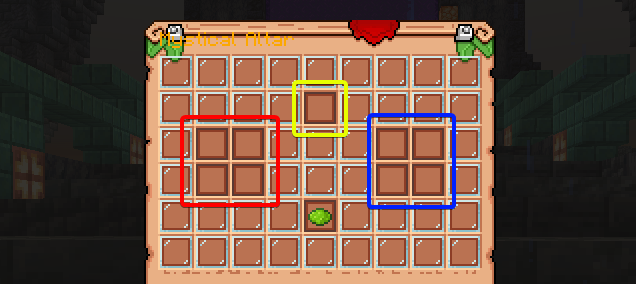

---

### Хто такий Потойбічний?

**Потойбічний** — це гравець, який випив магічне зілля та здобув надзвичайні здібності. Хочете стати одним із них? Тоді вам знадобляться **Магічний Котел** та правильні інгредієнти!

---

### Що таке Магічний Котел?

Щоб варити магічні зілля, вам потрібно створити **Магічний Котел**. Це спеціальна багатоблокова конструкція, яку ви повинні **побудувати власноруч**. Щойно вона буде зібрана, ви зможете взаємодіяти з котлом!

Існує **три рівні** Магічних Котлів, кожен з яких складніший у побудові, ніж попередній:

| Рівень | Назва | Ефект |
|------|------|--------|
| 1 | Грубий Котел | Найнижчий шанс успішного варіння |
| 2 | Звичайний Котел | Стандартний шанс успішного варіння |
| 3 | Покращений Котел | Найвищий шанс успішного варіння |

:::tip[Пошук креслень]
Креслення для побудови котла можна знайти в **контейнерах з лутом**, розкиданих по всьому світу. Натисніть **ЛКМ** на знайденому кресленні, щоб розмістити конструкцію, і дотримуйтесь інструкцій у чаті!
:::

---

### Що таке Жертовні Вівтарі?

На додаток до Магічних Котлів, існують також **Жертовні Вівтарі** — окремі структури, що використовуються для зовсім іншої мети (наприклад, для просування Божих Дарів). Як і котли, вони бувають трьох рівнів:

- **Грубий Жертовний Вівтар**
- **Звичайний Жертовний Вівтар**
- **Покращений Жертовний Вівтар**

Їхні креслення також можна знайти в контейнерах з лутом по всьому світу.

---

### Що таке інгредієнти Потойбіччя?

Для створення магічного зілля вам знадобляться **основні** та **допоміжні** інгредієнти Потойбіччя. Зазвичай це **предмети Потойбіччя**, які можна знайти або отримати, виконавши певні умови.

Які саме? Вам доведеться з'ясувати це **самостійно!** Різні предмети походять із різних джерел!

---

### Що таке Хари Потойбічного?

**Хари Потойбічного** — це спеціальний предмет, який може **замінити всі основні інгредієнти** в рецепті зілля одночасно.

Наприклад, якщо для зілля потрібно **3 різних основних інгредієнти**, один набір Хар може повністю замінити їх усіх.

Крім варіння, Хари Потойбічного мають додаткові застосування:
- Вони використовуються для крафту **Запечатаних Артефактів**.
- Деякі шляхи могут **споживати** їх безпосередньо для спеціальних ефектів.

:::tip[Характеристики Потойбічного]
Ви також можете зустріти звичайні **Характеристики Потойбічного** — кольорові сфери / голови гравців — у світі. Вони функціонують подібним чином, але є окремою категорією предметів.
:::

---

### Що таке рецепти Потойбіччя?

Щоб зварити зілля, потрібно знати правильне поєднання інгредієнтів.

**Де знайти рецепти?**

У відкритому світі ви можете знайти **повні рецепти** — стародавні книги з повним списком необхідних інгредієнтів. Зазвичай їх знаходять у **контейнерах з лутом**, виявлених під час ваших подорожей.

Ви також можете знайти **окремі сторінки рецептів** — поодинокі фрагменти рецепта. Їх можна **об'єднати на верстаку**, щоб сформувати повну книгу рецептів!

---

### Що таке ритуали Потойбіччя?

Кожен гравець має **унікальний, випадково призначений ритуал**, який він повинен виконати, щоб безпечно випити зілля. Вимоги ритуалу зазвичай з'являються як досягнення.

:::caution[Ритуали необов'язкові, але...]
Ви **не зобов'язані** виконувати ритуал перед вживанням зілля. Однак ігнорування його **збільшить ваше Божевілля**, що може мати серйозні довгострокові наслідки. Наполегливо рекомендується спочатку виконати ритуал.
:::

---

### Термін придатності зілля

Зварені зілля **не зберігаються вічно**. Кожне зілля має термін придатності **2 реальних дні** з моменту його першої появи у світі.

:::danger[Увага]
Через 2 дні невикористане зілля автоматично перетвориться на **випадковий Запечатаний Артефакт**. Обов'язково використайте його вчасно!
:::

---

### Як стати Потойбічним?

Щоб стати Потойбічним, виконайте такі кроки:

1. **Знайдіть** повний рецепт або об'єднайте окремі сторінки на верстаку.
2. **Побудуйте** Котел Потойбічного за допомогою його креслення.
3. **Зберіть** усі необхідні основні та допоміжні інгредієнти (або Хари Потойбічного, щоб замінити основні).
4. **Виконайте** свій особистий ритуал, щоб уникнути отримання Божевілля.
5. **Помістіть** компоненти в котел:

- **Основні** інгредієнти (або Хари) — **ліворуч** 🔴
- **Допоміжні** інгредієнти — **праворуч** 🔵
- **Рецепт** — по **центру** 🟡

:::tip[Зверніть увагу]
Для роботи котла інгредієнти повинні бути розміщені в тому ж порядку, в якому вони вказані в рецепті. Котел вищого рівня покращує ваші шанси на успішне варіння!
:::

Якщо все зроблено правильно — у вашому інвентарі з'явиться **зілля**, яке ви можете випити, щоб отримати сили. Якщо щось піде не так — інгредієнти залишаться на місці, а зілля **не буде створено**!
